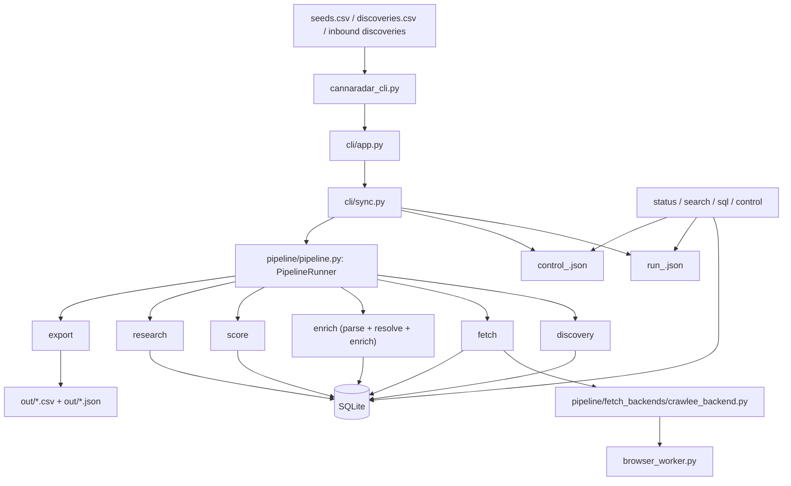

# CannaRadar

> Private, local-first crawler and lead-intelligence system for cannabis outbound.

CannaRadar turns seed domains into scored, evidence-backed, outreach-ready leads. It crawls public sites, extracts contact and buyer signals, resolves them into a canonical SQLite model, generates research briefs, and emits deterministic exports that an operator or agent can actually use.

## At a Glance

| Area | Current shape |
| --- | --- |
| Runtime model | Python 3.11 CLI |
| Orchestration | `cannaradar_cli.py` -> `cli/app.py` -> `cli/sync.py` |
| Core engine | `pipeline/pipeline.py:PipelineRunner` |
| Crawl layer | Crawlee HTTP-first + isolated Playwright browser worker |
| Persistence | SQLite + JSON run/checkpoint state |
| Outputs | CSV exports + quality/change artifacts |
| Operating mode | agent-operable, resumable, batch-first |

## Why This Exists

The point of this repo is not “generic crawling.” The point is to create a reliable internal machine for:

- finding cannabis retail opportunities
- extracting public proof and contact signals
- ranking which locations matter first
- producing stable handoff artifacts for outbound work
- letting an agent operate the system without constant human babysitting

This is a private operating system for lead generation, not a public-facing product surface.

## One-Screen Mental Model

1. Seeds enter from `seeds.csv`, `discoveries.csv`, and optional inbound discovery drops.
2. The CLI starts a checkpointed run and builds a seed plan.
3. Fetch crawls each seed domain, records `crawl_jobs` / `crawl_results`, and self-heals around junk paths, blocks, and browser failures.
4. Enrich parses raw pages, resolves canonical locations, writes evidence, contacts, and domains.
5. Score ranks locations.
6. Research builds deterministic lead briefs and gap summaries.
7. Export emits outreach, research, signal, and quality artifacts.
8. Status, search, sql, and control expose live and historical state for operators and agents.

## System Shape



## The Important Brains

- **Run orchestration**: `cli/sync.py` and `pipeline/pipeline.py`
  These decide what runs, in what order, and how resume/failure flows behave.
- **Crawl behavior**: `pipeline/fetch_backends/crawlee_backend.py`
  This is where the system decides what to fetch, what to skip, when to escalate to browser mode, and how to survive bad domains.
- **Extraction and canonicalization**: `pipeline/stages/parse.py` and `pipeline/stages/resolve.py`
  These turn raw HTML into structured business facts.
- **Lead judgment**: `pipeline/stages/score.py`
  This is the ranking brain.
- **Follow-up guidance**: `pipeline/stages/research.py`
  This builds the agent-ready lead brief and gap summary.
- **Agent-operability**: `pipeline/run_state.py`, `pipeline/run_control.py`, `cli/query.py`, `cli/control.py`
  These are what make the system resumable, inspectable, and steerable.

## How It Runs

### Canonical workflow

```bash
python3.11 cannaradar_cli.py init --json
python3.11 cannaradar_cli.py doctor --json
python3.11 cannaradar_cli.py sync --json --crawl-mode growth --max 50
python3.11 cannaradar_cli.py status --json
python3.11 cannaradar_cli.py export --json --kind all
```

### Resume workflow

```bash
python3.11 cannaradar_cli.py status --json
python3.11 cannaradar_cli.py sync --json --resume latest
```

### Continuous monitor loop

```bash
python3.11 cannaradar_cli.py tail --json --crawl-mode monitor --interval-seconds 300
```

### Scheduled wrapper

```bash
./run_v4.sh
```

`run_v4.sh` is the safe shell wrapper. It adds locking, optional canonical ingest, export-change diffing, and manifest post-processing around the canonical CLI.

## Fast Start

```bash
python3.11 -m venv .venv
source .venv/bin/activate
python -m pip install -r requirements.txt
playwright install chromium

PYTHONPATH=$PWD python3.11 jobs/ingest_sources.py
python3.11 cannaradar_cli.py init --json
python3.11 cannaradar_cli.py doctor --json
python3.11 cannaradar_cli.py sync --json --seeds seeds.csv --max 25 --crawl-mode growth
python3.11 cannaradar_cli.py status --json
```

## Command Surface

### Primary commands

| Command | Purpose |
| --- | --- |
| `init` | bootstrap config, DB, state directories, and policy files |
| `doctor` | preflight checks for runtime, schema, config, paths, and browser availability |
| `sync` | run the full checkpointed pipeline |
| `tail` | repeat `sync` on an interval for monitor workflows |
| `status` | summarize manifest, DB state, checkpoint state, outputs, and recent failures |
| `control` | inspect or apply bounded live interventions |
| `search` | query curated diagnostics and local lead state |
| `sql` | read-only SQL surface over local SQLite |
| `export` | generate outreach, research, signal, and quality outputs |

### Useful control examples

```bash
python3.11 cannaradar_cli.py control --json --run-id latest show
python3.11 cannaradar_cli.py control --json --run-id latest quarantine-seed --domain bad.example --reason dns_failure
python3.11 cannaradar_cli.py control --json --run-id latest suppress-prefix --domain example.com --prefix /blog/ --reason low_value_path
python3.11 cannaradar_cli.py control --json --run-id latest cap-domain --domain example.com --max-pages 2 --reason noisy_domain
```

## What Comes Out

Primary runtime outputs:

- `out/outreach_ready_<run_id>.csv`
- `out/outreach_dispensary_100.csv`
- `out/research_queue.csv`
- `out/agent_research_queue.csv`
- `out/new_leads_only.csv`
- `out/callable_leads.csv`
- `out/quality_report.json`
- `data/state/last_run_manifest.json`
- `data/state/agent_runs/run_<id>.json`
- `data/state/agent_runs/control_<id>.json`

The key promise is determinism: the pipeline writes stable files and stable machine-readable CLI envelopes so an operator or agent can reason about what happened without scraping console text.

## Operational Invariants

- Discovery is deduped by normalized `website + state`.
- Fetch is public-web only, HTTP-first, and same-domain constrained by design.
- Browser escalation is isolated so Playwright failures do not take down the main batch.
- Resolution is deterministic; this repo does not auto-merge entities recklessly.
- Scoring is explainable through `lead_scores` and `scoring_features`.
- Research is deterministic synthesis over stored evidence, not a hidden LLM workflow.
- Exports are contract-shaped and intended to remain stable.

## Repo Landmarks

| Area | What it owns |
| --- | --- |
| `cli/` | command contract, output envelopes, diagnostics, status/search/sql/control |
| `pipeline/` | orchestration, fetch, parsing, resolution, scoring, research, exports |
| `pipeline/fetch_backends/` | Crawlee runtime, browser worker, fetch persistence, policy loading |
| `db/schema.sql` | canonical storage model |
| `jobs/` | schema bootstrap, change diffing, outreach logging |
| `docs/` | deep internal architecture and operator docs |
| `run_v4.sh` | scheduled-run wrapper |

## Read Next

- [Internal docs index](./docs/README.md)
- [Purpose and overview](./docs/01-purpose-and-overview.md)
- [Architecture](./docs/02-architecture.md)
- [Runtime flow](./docs/04-runtime-flow.md)
- [State and lifecycle](./docs/10-state-and-lifecycle.md)
- [Failure modes and recovery](./docs/11-failure-modes-and-recovery.md)
- [How to modify the system](./docs/12-how-to-modify-the-system.md)
- [Agent ops playbook](./docs/AGENT_OPS_PLAYBOOK.md)
- [Runbook](./docs/RUNBOOK_V1.md)

## Private Repo Notes

This repo is intentionally not positioned as a generic open-source crawler.

What is valuable here is the combination of:

- cannabis-specific signal extraction
- lead prioritization rules
- agent-operable run control
- deterministic exports for outbound workflows

Treat the README as an internal landing page, and use `docs/` for the full system mental model.
