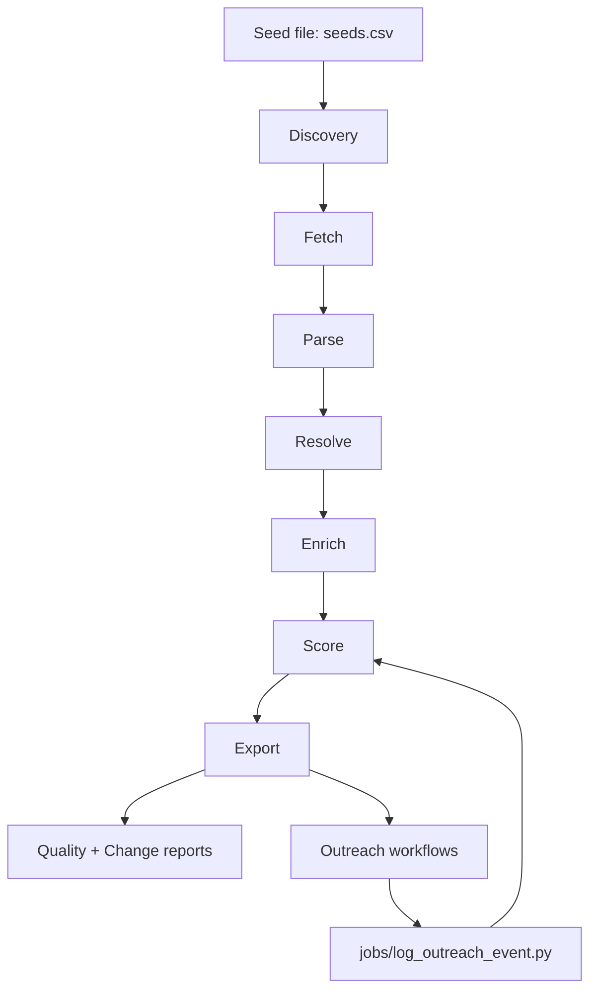

# CannaRadar v1.5

CannaRadar is a local-first, evidence-backed lead intelligence pipeline for cannabis outbound.

The system discovers dispensary leads from public sources, crawls and extracts business contact signals, deduplicates entities, scores leads, and emits stable outreach-ready CSVs for execution.

## What v1.5 delivers today

- Dispensary-first discovery with segment-aware exports.
- Public-web only crawling with configurable polite behavior.
- Deterministic entity resolution and merge suggestions.
- Explainable lead scoring with persisted feature vectors.
- Operational artifacts for quality monitoring and change diffing.
- Migration-validated SQLite schema lifecycle.

## Core architecture



## Repository map

- `pipeline/`: stage modules and orchestration.
  - `pipeline/config.py`: runtime config load and env overrides.
  - `pipeline/db.py`: SQLite connection helpers.
  - `pipeline/observability.py`: JSON logs and metrics counters.
  - `pipeline/pipeline.py`: orchestrator entrypoint methods.
  - `pipeline/quality.py`: quality report generation.
  - `pipeline/stages/discovery.py`: seed parsing and dedupe.
  - `pipeline/stages/fetch.py`: robots-aware fetch and retry policy.
  - `pipeline/stages/parse.py`: page extraction logic.
  - `pipeline/stages/resolve.py`: entity dedupe and merge suggestions.
  - `pipeline/stages/enrich.py`: enrichment steps.
  - `pipeline/stages/score.py`: feature scoring.
  - `pipeline/stages/export.py`: deterministic CSV/report outputs.
- `jobs/`
  - `jobs/ingest_sources.py`: schema/migration bootstrap + hard checks.
  - `jobs/export_changes.py`: snapshot diffing and change tracking.
  - `jobs/log_outreach_event.py`: outcome logging.
- `db/schema.sql`: canonical schema and constraints.
- `cannaradar_cli.py`: command interface.
- `run_v4.sh`: safe scheduled runner.
- `docs/RUNBOOK_V1.md`: operator runbook.
- `README_AI_AGENTS.md`: AI-agent operating reference.
- `SKILL.md`: repo-local CannaRadar AI-agent skill/playbook.

## Command surface

### Daily execution

- `python3 cannaradar_cli.py crawl:run --seeds seeds.csv --max 200`
- `./run_v4.sh`

### Stage-level execution

- `python3 cannaradar_cli.py enrich:run --since "<ISO_TIMESTAMP>"`
- `python3 cannaradar_cli.py score:run`
- `python3 cannaradar_cli.py export:outreach --tier A --limit 200`
- `python3 cannaradar_cli.py export:research --limit 200`
- `python3 cannaradar_cli.py quality:report`

### Maintenance

- `PYTHONPATH=$PWD python3 jobs/ingest_sources.py`
- `python3 jobs/export_changes.py --run-id <YYYYMMDD-HHMMSS>`
- `python3 jobs/log_outreach_event.py --website <domain> --channel email --outcome replied --notes "<text>"`
- `./run_smoke_tests.sh`

## Output matrix

- `out/outreach_ready_<YYYYMMDD-HHMMSS>.csv`
- `out/outreach_dispensary_100.csv`
- `out/excluded_non_dispensary.csv`
- `out/merge_suggestions_<YYYYMMDD-HHMMSS>.csv`
- `out/research_queue.csv`
- `out/v4_quality_report.txt`
- `out/quality_report.json`
- `out/changes_<YYYYMMDD-HHMMSS>.csv`
- `out/changes_<YYYYMMDD-HHMMSS>.txt`
- `data/state/last_run_manifest.json`
- `data/state/last_change_metrics.json`

## Output schemas

### Outreach-ready row

`company_name, location, website, menu_provider, contact_name, contact_title, email, phone, score, tier, proof_urls`

### Legacy compatibility row

`dispensary, segment, website, state, market, owner_name, owner_role, email, phone, source_url, score, checked_at, segment_confidence, segment_reason`

### Research queue row

`company_name, website, contact_name, contact_title, email, phone, state, recommended_action, score`

## Stage behavior and invariants

- Discovery: seeds are canonicalized and deduped by website+state.
- Fetch: respect robots.txt when enabled, per-domain intervals, and configured max pages.
- Parse: extract emails, phones, staff-role pairs, and menu-provider signals.
- Resolve: deterministic matching and merge suggestions; no destructive merges.
- Enrich: first-party signals first; email inference is explicit low-confidence only.
- Score: persisted feature vector per location and auditable tiers.
- Export: segment filter and rank logic are deterministic and reproducible.

## Quality and explainability

Quality report emits:

- `% leads with email`
- `% leads with buyer-ish title`
- duplicate domain rate
- freshness distribution
- top menu providers

Each score is stored as:

- `lead_scores(score_total, tier, run_id)`
- `scoring_features(feature_name, feature_value)`

You can inspect these tables directly for explanation or export review.

## Migration and schema health

`jobs/ingest_sources.py` enforces:

- exact `PRAGMA user_version`
- required tables and required columns
- required indexes
- `schema_migrations` checksum + current-version presence

If checks fail, runbook-prescribed rollback guidance in `docs/RUNBOOK_V1.md` applies.

## Local run example

```bash
cd /Users/horcrux/Development/CannaRadar
python3 -m venv .venv
source .venv/bin/activate
python -m pip install -r requirements.txt

PYTHONPATH=$PWD python3 jobs/ingest_sources.py
python3 cannaradar_cli.py crawl:run --seeds seeds.csv
```

## AI-agent operating instructions

Use this order for safe modifications:

- Inspect `pipeline/stages/` for stage-specific behavior changes first.
- Keep edits stage-local and additive by default.
- Update tests and docs for any behavior change.
- If changing persistence, adjust `db/schema.sql`, then `jobs/ingest_sources.py`, then run schema tests.
- If changing scores, update `pipeline/stages/score.py` and expected ranges/features.

Use strict confidence tracking for every new extraction path and always provide evidence URLs in `evidence` rows.

### AI skill pointer

- Skill path: `SKILL.md` (in this repo)
- Use this when you need structured, stage-safe changes or AI handoffs.

## Troubleshooting

- Schema failures: run `PYTHONPATH=$PWD python3 jobs/ingest_sources.py` and follow rollback steps.
- Empty exports: confirm crawl seeds and denylist, then review `out/v4_quality_report.txt`.
- Missing segment purity: inspect `segment` in `out/outreach_ready_<run_id>.csv` and `out/excluded_non_dispensary.csv`.
- Run artifact gaps: ensure `data/state/` exists and pipeline write permissions are available.

## What is considered unnecessary to keep in the repo

- Old v4-only notes.
- Duplicate runbooks describing the same commands with different semantics.
- Experimental notes that are not in active operator flow.

If a doc does not describe a run path that can execute in `v1.5`, move it to historical archive or remove it from the onboarding path.
