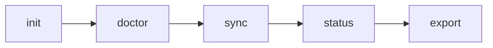

# 01 Purpose and Overview

## What This Project Is

CannaRadar is a batch-oriented lead generation and lead qualification system for cannabis outbound.

At its core, the repo turns seed websites into a canonical local database of:

- organizations
- companies
- locations
- domains
- contacts and contact points
- evidence and enrichment facts
- lead scores and score features
- outreach-ready exports

The pipeline is implemented in `pipeline/` and exposed through the canonical CLI in `cannaradar_cli.py` and `cli/`.

## Why It Exists

The repo exists to answer a specific operational problem: find and rank cannabis dispensary leads from public data, then hand stable, explainable outputs to outbound workflows.

The code emphasizes:

- local execution over hosted infrastructure
- deterministic exports over ad hoc scraping output
- explainable scoring over opaque ranking
- resumable operation over one-shot scripts
- machine-readable CLI behavior over human-only logs

## What It Is Not

Inferred from code:

- It is not a web server.
- It is not a background daemon with its own internal scheduler.
- It is not a distributed crawler cluster.
- It is not a generic scraping framework.
- It does not currently depend on an external LLM or external SaaS API token to run the main pipeline.

The runtime model is a local CLI plus optional shell wrapper automation.

## Core Domain Concepts

### Seed

A seed is an input website row from `seeds.csv`, `discoveries.csv`, or `data/inbound/discoveries_inbound.csv`, represented by `pipeline/stages/discovery.py:DiscoverySeed`.

Seeds are the crawl starting points.

### Crawl Job

A crawl job is one per seed domain per run, tracked in:

- `crawl_jobs`
- `crawl_results`
- `seed_telemetry`

This is the operational fetch record.

### Location

A location is the main lead unit in the system, stored in `locations`. Most downstream behavior works at the location level.

### Evidence

Evidence is the system’s proof model. Parsed facts, menu provider detections, social links, inferred email signals, and agent research summaries are persisted as `evidence` rows.

### Lead Score

A score is an auditable heuristic ranking stored in:

- `lead_scores`
- `scoring_features`

The score is used to tier and prioritize export output.

### Agent Research Brief

An agent research brief is a structured follow-up record built in `pipeline/stages/research.py`. It describes gaps, suggested public paths, target roles, recommended next action, and a summary of current signal quality.

## Runtime Model

The repo is a hybrid of:

- CLI application
- batch pipeline
- local stateful crawler
- resumable agent-ops tool

The normal run path is:

`sync` is the main orchestrated run. `tail` is a simple repeat loop around `sync`. `run_v4.sh` is an external wrapper for scheduled or production-style invocation.

## Main Success Criteria The Code Optimizes For

- Fetch enough public pages to extract real contact and buyer signals.
- Keep the crawl polite and bounded.
- Preserve stable downstream contracts for outreach CSVs.
- Make failures classifiable and resumable.
- Keep state inspectable by humans and agents.

## Important Non-Goals Visible In Code

These are absence statements based on what is actually implemented:

- No login flow management in the main repo runtime.
- No external queue broker such as Redis, RabbitMQ, or SQS.
- No external document store or hosted vector DB.
- No internal planner model or tool-calling LLM loop inside the repo. The “agent” capability here means agent-operable CLI/state surfaces, not an embedded reasoning model.

## Where To Start Reading Code

- `cannaradar_cli.py`
- `cli/app.py:main`
- `cli/sync.py:execute_sync`
- `pipeline/pipeline.py:PipelineRunner`
- `pipeline/fetch_backends/crawlee_backend.py:run_fetch`

Those files define the repo’s real execution model.

