# 02 Architecture

## Architectural Summary

CannaRadar is a layered, local-first pipeline with four major planes:

1. Command plane: CLI parsing, output envelopes, exit semantics.
2. Orchestration plane: run setup, checkpointing, stage order, retry/resume boundaries.
3. Stage plane: discovery, fetch, enrich, score, research, export.
4. Persistence and artifact plane: SQLite, run-state JSON, run-control JSON, manifests, CSVs, reports.

## High-Level Component Graph

```mermaid
graph TD
    subgraph CommandPlane["Command plane"]
        App["cli/app.py"]
        Sync["cli/sync.py"]
        Doctor["cli/doctor.py"]
        Query["cli/query.py"]
        Control["cli/control.py"]
        Output["cli/output.py"]
        Errors["cli/errors.py"]
    end

    subgraph OrchestrationPlane["Orchestration plane"]
        Runner["pipeline/pipeline.py: PipelineRunner"]
        RunState["pipeline/run_state.py"]
        RunControl["pipeline/run_control.py"]
        Config["pipeline/config.py"]
        Obs["pipeline/observability.py"]
    end

    subgraph StagePlane["Stage plane"]
        Discovery["pipeline/stages/discovery.py"]
        Fetch["pipeline/stages/fetch.py"]
        Crawlee["pipeline/fetch_backends/crawlee_backend.py"]
        Worker["pipeline/fetch_backends/browser_worker.py"]
        Parse["pipeline/stages/parse.py"]
        Resolve["pipeline/stages/resolve.py"]
        Enrich["pipeline/stages/enrich.py"]
        Score["pipeline/stages/score.py"]
        Research["pipeline/stages/research.py"]
        Export["pipeline/stages/export.py"]
        Quality["pipeline/quality.py"]
    end

    subgraph PersistencePlane["Persistence and artifacts"]
        SQLite["SQLite DB"]
        Checkpoints["run_<id>.json"]
        Controls["control_<id>.json"]
        Manifest["data/state/last_run_manifest.json"]
        Out["out/*.csv, *.json, *.txt"]
    end

    App --> Sync
    App --> Doctor
    App --> Query
    App --> Control
    App --> Output
    App --> Errors

    Sync --> Runner
    Sync --> RunState
    Sync --> RunControl
    Sync --> Obs
    Doctor --> Config
    Runner --> Config

    Runner --> Discovery
    Runner --> Fetch
    Fetch --> Crawlee
    Crawlee --> Worker
    Runner --> Parse
    Runner --> Resolve
    Runner --> Enrich
    Runner --> Score
    Runner --> Research
    Runner --> Export
    Export --> Quality

    Crawlee --> SQLite
    Runner --> SQLite
    Sync --> Checkpoints
    Sync --> Controls
    Runner --> Manifest
    Runner --> Out
```

## Architectural Boundaries

### 1. Canonical CLI Boundary

`cli/app.py:main` is the stable boundary for operators and agents. It owns:

- command names
- flag surfaces
- output mode selection (`--json`, `--plain`)
- exception classification into stable exit codes

It does not own business logic. It dispatches to `cli/doctor.py`, `cli/sync.py`, `cli/query.py`, and `cli/control.py`.

### 2. Orchestrator Boundary

`cli/sync.py:execute_sync` owns the run contract:

- run id
- checkpoint file creation and updates
- stage order
- resume semantics
- stage failure marking
- final run summary

`pipeline/pipeline.py:PipelineRunner` owns the actual work performed within each stage.

### 3. Fetch Boundary

`pipeline/stages/fetch.py` is intentionally thin. The real fetch system lives in:

- `pipeline/fetch_backends/common.py`
- `pipeline/fetch_backends/crawlee_backend.py`
- `pipeline/fetch_backends/domain_policy.py`
- `pipeline/fetch_backends/browser_worker.py`

This is the subsystem with the most runtime policy and operational safeguards.

### 4. Persistence Boundary

SQLite is the durable business state store. JSON files under `data/state/agent_runs/` are run-control metadata, not the business record.

That distinction matters:

- SQLite persists leads, evidence, scores, crawl outputs.
- run-state JSON persists resumability and stage progress.
- run-control JSON persists live interventions and runtime counters.

## The Real Stage Architecture

The named stages in `cli/sync.py:execute_sync` are:

1. `discovery`
2. `fetch`
3. `enrich`
4. `score`
5. `research`
6. `export`

Inferred from code: the `enrich` stage is actually a composite stage. `pipeline/pipeline.py:PipelineRunner.run_enrich` performs:

- parse via `pipeline/stages/parse.py:parse_page`
- resolve via `pipeline/stages/resolve.py:resolve_and_upsert_locations`
- enrichment via `pipeline/stages/enrich.py:run_waterfall_enrichment`

So parse and resolve are conceptual subsystems, but not first-class checkpoint stages.

## The System’s Main “Brains”

If you want the highest-signal files for understanding or modifying behavior, they are:

### Crawl planning and run policy

- `pipeline/pipeline.py:PipelineRunner._discovery_stage`
- `pipeline/pipeline.py:PipelineRunner._monitoring_stage`
- `pipeline/pipeline.py:PipelineRunner._build_seed_plan`
- `pipeline/pipeline.py:PipelineRunner._growth_governor`
- `pipeline/pipeline.py:PipelineRunner._run_reliability_gate`

### Crawl execution and recovery behavior

- `pipeline/fetch_backends/crawlee_backend.py:SeedCrawlState`
- `pipeline/fetch_backends/crawlee_backend.py:_run_http_crawl`
- `pipeline/fetch_backends/crawlee_backend.py:_run_browser_crawl_dispatch`
- `pipeline/fetch_backends/crawlee_backend.py:_handle_seed_crawl_exception`
- `pipeline/fetch_backends/common.py:SeedRunRecorder`

### Extraction and canonicalization

- `pipeline/stages/parse.py:parse_page`
- `pipeline/stages/resolve.py:resolve_and_upsert_locations`
- `pipeline/stages/enrich.py:run_waterfall_enrichment`

### Lead prioritization

- `pipeline/stages/score.py:score_location`
- `pipeline/stages/research.py:build_lead_research_briefs`
- `pipeline/stages/export.py:export_outreach`

## Secondary Runtime Paths

### `run_v4.sh`

This is a shell wrapper that:

- acquires a lock
- optionally runs schema/bootstrap ingest
- resolves the seed file
- calls the CLI through the legacy `crawl:run` alias
- runs `jobs/export_changes.py`
- rewrites `data/state/last_run_manifest.json`
- applies a segment guardrail check

It is an operational wrapper around the CLI, not a separate implementation of the pipeline.

### `jobs/ingest_sources.py`

This is a bootstrap and schema validator plus a lightweight source-ingest path. It uses adapters from `adapters/`, but only `adapters/seeds_adapter.py` is enabled in `adapters/registry.py` today.

This means the “adapter” system exists, but it is not the core live crawl path.

## Architectural Patterns Used

- Local-first persistence with SQLite.
- Command/query split at the CLI layer.
- Stage checkpointing instead of fine-grained workflow replay.
- Agent-operable run control through explicit JSON state files.
- HTTP-first fetch with controlled browser escalation.
- Rule-based, explainable scoring and segmentation.

## Architectural Omissions

If you are looking for these patterns, they are not present as primary architecture:

- no internal event bus
- no message broker queue
- no central service registry
- no REST or GraphQL API
- no plugin system for live crawling beyond the fetch policy file and the limited ingest adapter registry

