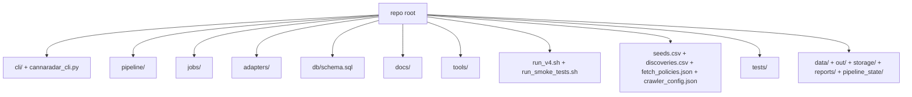

# 03 Repo Structure

This document explains the repository by responsibility, not just by folder name.

## Top-Level Structure

## Runtime-Critical Code

### `cannaradar_cli.py`

Responsibility:

- tiny executable wrapper that imports `cli.app.main`

Called by:

- humans
- agents
- `run_v4.sh`

Calls:

- `cli/app.py:main`

Reads/writes:

- no direct state

Role:

- startup path

### `cli/`

Responsibility:

- command parsing
- command dispatch
- doctor/init
- status/search/sql query surface
- control surface
- sync/tail/export orchestration entrypoints
- CLI output shaping
- exit code semantics

Key modules:

- `cli/app.py`
- `cli/sync.py`
- `cli/doctor.py`
- `cli/query.py`
- `cli/control.py`
- `cli/output.py`
- `cli/errors.py`

Called by:

- `cannaradar_cli.py`

Calls:

- `pipeline/pipeline.py`
- `pipeline/run_state.py`
- `pipeline/run_control.py`
- `pipeline/db.py`
- `jobs/ingest_sources.py` in init/doctor flows

State read/write:

- DB path passed by CLI
- `data/state/agent_runs/*.json`
- `data/state/last_run_manifest.json`
- `out/*` snapshots via status

Role:

- startup path
- agent control path
- operator query surface

### `pipeline/`

Responsibility:

- business logic
- crawl orchestration
- persistence and data transformation
- metrics/logging
- resumability helpers

Sub-areas:

- `pipeline/pipeline.py`: main orchestrator
- `pipeline/stages/`: domain pipeline logic
- `pipeline/fetch_backends/`: crawl engine and runtime controls
- `pipeline/run_state.py`: checkpoint state
- `pipeline/run_control.py`: live intervention state
- `pipeline/config.py`: config loading
- `pipeline/db.py`: SQLite connection bootstrap
- `pipeline/observability.py`: JSON logs and counters
- `pipeline/quality.py`: quality report output
- `pipeline/utils.py`: normalization, PKs, utility parsing helpers

Called by:

- `cli/`

Calls:

- Crawlee / Playwright
- SQLite
- filesystem

State read/write:

- canonical DB
- JSON checkpoints and control files
- output files

Role:

- core runtime path

## Support and Maintenance Code

### `jobs/`

Responsibility:

- schema bootstrap and validation
- snapshot diffing
- outreach feedback logging

Modules:

- `jobs/ingest_sources.py`
- `jobs/export_changes.py`
- `jobs/log_outreach_event.py`

Called by:

- `cli/doctor.py`
- `cli/sync.py` indirectly through `run_v4.sh`
- humans/operators

Calls:

- `adapters/`
- SQLite
- filesystem

State read/write:

- DB schema
- canonical DB seed/license/location bootstrap
- change reports in `out/`
- `data/state/last_change_metrics.json`
- `outreach_events`

Role:

- startup support
- maintenance utility
- post-run utility

### `adapters/`

Responsibility:

- lightweight source-ingest abstraction for bootstrap ingestion

Current reality:

- `adapters/registry.py` enables only `SeedsAdapter`
- `adapters/seeds_adapter.py` turns `seeds.csv` into `LicenseRow`-like bootstrap records

Called by:

- `jobs/ingest_sources.py`

Calls:

- CSV parsing only

State read/write:

- no direct writes; emits normalized rows to ingest job

Role:

- maintenance/bootstrap utility

Assumption:

The adapter system is preparatory infrastructure for future ingest sources, but today it is not the main discovery or crawl pipeline.

### `tools/`

Responsibility:

- offline data hygiene and ranking utilities

Tools:

- `tools/seed_hygiene.py`
- `tools/discovery_rank_signals.py`
- `tools/discovery_baseline.py`

Called by:

- humans/operators

Calls:

- CSV/JSON filesystem operations

State read/write:

- reads `seeds.csv`, `discoveries.csv`
- writes reports/cleaned ranked CSVs under `out/` or `reports/`

Role:

- support utility

## Configuration and Inputs

### `crawler_config.json`

Responsibility:

- main runtime configuration file, loaded by `pipeline/config.py:load_crawl_config`

### `fetch_policies.json`

Responsibility:

- per-domain fetch policy overrides for browser mode, wait selectors, and caps

### `seeds.csv`

Responsibility:

- canonical discovery seed inventory

### `discoveries.csv`

Responsibility:

- secondary discovery file, often used as an operator-managed or inbound-enriched discovery source

## Persistence and Generated Data

### `db/schema.sql`

Responsibility:

- canonical database schema contract

Role:

- startup path
- schema validation source of truth

### `data/`

Responsibility:

- runtime state and SQLite DB storage

Observed contents:

- `data/cannaradar_v1.db`
- `data/state/last_run_manifest.json`
- `data/state/agent_runs/`
- optionally `data/inbound/discoveries_inbound.csv`

Role:

- persistent runtime data

### `out/`

Responsibility:

- operator-facing CSV and report outputs

Role:

- export artifact store

### `storage/`, `pipeline_state/`, `reports/`

Responsibility:

- support/generated runtime artifacts

Inferred from code:

- `storage/` likely holds Crawlee local storage artifacts
- `pipeline_state/` is not a primary code-managed runtime path in the current implementation
- `reports/` is used by `tools/discovery_baseline.py`

## Tests

### `tests/`

Responsibility:

- command contract tests
- checkpoint/control tests
- fetch behavior tests
- parse/resolve tests
- research export tests
- smoke coverage when generated artifacts exist

Important files:

- `tests/test_agent_cli.py`
- `tests/test_run_state.py`
- `tests/test_fetch_config.py`
- `tests/test_fetch_dispatch.py`
- `tests/test_fetch_integration.py`
- `tests/test_parse_stage.py`
- `tests/test_resolve_stage.py`
- `tests/test_lead_research.py`
- `tests/smoke_v1.py`

Role:

- validation and regression safety

## What Looks Runtime-Critical vs Optional

Runtime-critical:

- `cli/`
- `pipeline/`
- `db/schema.sql`
- `crawler_config.json`
- `fetch_policies.json`
- `seeds.csv`

Operationally important but not core runtime:

- `run_v4.sh`
- `jobs/export_changes.py`
- `jobs/log_outreach_event.py`
- `tools/`

Clearly support/bootstrap, not live crawl path:

- `adapters/`
- `jobs/ingest_sources.py`

