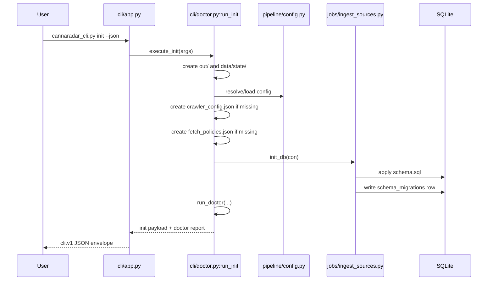
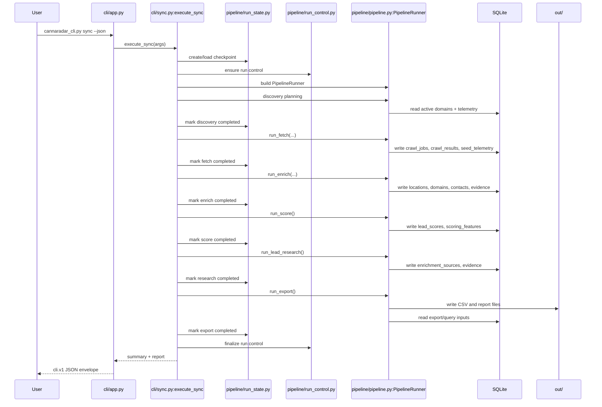
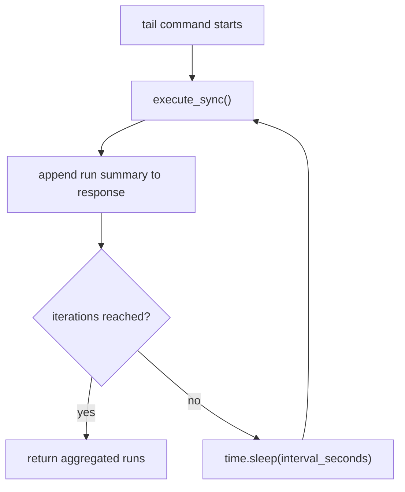

# 04 Runtime Flow

This document traces startup, initialization order, and end-to-end runtime behavior.

## Primary Entry Point

The main process entrypoint is `cannaradar_cli.py`, which immediately delegates to `cli/app.py:main`.

Startup order for every CLI invocation:

1. `cli/app.py:main` checks Python version via `_require_python_311`.
2. It builds the parser with `make_parser`.
3. It applies `--config` to `CANNARADAR_CRAWLER_CONFIG` if provided.
4. It dispatches to the appropriate command handler.
5. It emits a stable success or error envelope through `cli/output.py`.

## `init` Startup Flow

`init` is implemented by `cli/doctor.py:run_init`.

## `doctor` Preflight Flow

`doctor` is implemented by `cli/doctor.py:run_doctor`.

It checks, in order:

1. Python runtime version.
2. Config file existence.
3. Config parseability.
4. Seed input path resolution.
5. Fetch policy file existence.
6. Writable DB parent, `out/`, `data/state/`, and run-state directory.
7. SQLite connectivity.
8. Schema validation through `jobs/ingest_sources.py:assert_schema_layout` and `assert_schema_migration`.
9. `crawlee` import availability.
10. Playwright Chromium runtime availability.
11. Disk space threshold.

Important nuance:

`doctor` is a runtime safety gate, not just a lint-style check. It is the only place that validates the schema/migration contract before a long run.

## `sync` End-to-End Flow

The canonical batch run path is `cli/sync.py:execute_sync`.

### Initialization Order

1. Ensure checkpoint directory through `pipeline/run_state.py:ensure_run_state_dir`.
2. Either create a new run state or load an existing one for resume.
3. Ensure a run-control file exists through `pipeline/run_control.py:ensure_run_control`.
4. Build a `PipelineRunner`.
5. Rehydrate any serialized discovery/monitor seeds if resuming.
6. Execute remaining stages in order.

### Sequence Diagram

## Stage Details In Runtime Order

### Discovery Stage

Implemented by:

- `pipeline/pipeline.py:PipelineRunner._intake_inbound_discovery_seeds`
- `pipeline/pipeline.py:PipelineRunner._growth_governor`
- `pipeline/pipeline.py:PipelineRunner._build_seed_plan`

Inputs:

- `seeds.csv`
- `discoveries.csv`
- optionally `data/inbound/discoveries_inbound.csv`
- DB active domains
- `seed_telemetry`
- prior manifest growth metrics

Outputs:

- discovery seed list
- monitoring seed list
- run-state stage details

### Fetch Stage

Implemented by:

- `pipeline/pipeline.py:PipelineRunner.run_fetch`
- `pipeline/fetch_backends/crawlee_backend.py:run_fetch`

Inputs:

- seed list
- config
- domain policies
- run control file
- DB cache/telemetry state

Outputs:

- `crawl_jobs`
- `crawl_results`
- `seed_telemetry`
- `FetchResult` list
- runtime control counters and interventions

### Enrich Stage

Implemented by `pipeline/pipeline.py:PipelineRunner.run_enrich`.

Inputs:

- `FetchResult` list or DB-backed fetch results loaded by `PipelineRunner._load_results_for_enrichment`

Internal steps:

1. Parse HTML using `pipeline/stages/parse.py:parse_page`.
2. Resolve or create canonical location via `pipeline/stages/resolve.py:resolve_and_upsert_locations`.
3. Write evidence, contacts, contact points, domains.
4. Run heuristic enrichment via `pipeline/stages/enrich.py:run_waterfall_enrichment`.
5. Mark crawl jobs as `enriched`.

Outputs:

- updated canonical entities in SQLite

### Score Stage

Implemented by `pipeline/stages/score.py:run_score`.

Inputs:

- locations
- contacts
- contact points
- evidence

Outputs:

- `lead_scores`
- `scoring_features`
- updated `locations.fit_score`

### Research Stage

Implemented by `pipeline/stages/research.py:run_lead_research`.

Inputs:

- latest scored locations
- evidence
- contacts
- contact points
- config-defined research paths

Outputs:

- `enrichment_sources`
- agent research evidence rows
- metrics counters for researched/enhanced locations

### Export Stage

Implemented by `pipeline/pipeline.py:PipelineRunner.run_export` plus `pipeline/stages/export.py`.

Outputs:

- outreach CSVs
- research queue CSV
- agent research queue CSV
- merge suggestions CSV
- new leads CSV
- buyer signal watchlist CSV
- quality report files
- stable copied CSV aliases such as `out/new_leads_only.csv`

## Resume Flow

Resume is stage-boundary based, not mid-request based.

When `sync --resume latest` runs:

1. `cli/sync.py:_load_requested_run_state` loads a prior run JSON.
2. Completed stages are skipped.
3. The current failed or interrupted stage is rerun.
4. Run-control state is reused.
5. Finalization rewrites stale `running` runtime statuses.

This is why the code invests heavily in durable writes during fetch and in explicit stage markers.

## `tail` Runtime Flow

`cli/sync.py:execute_tail` is intentionally simple:

It does not:

- daemonize itself
- manage locks
- provide a separate heartbeat thread

It is just a repeat loop with sleep.

## `run_v4.sh` Wrapper Flow

`run_v4.sh` is the production-style shell wrapper around the Python CLI.

Startup order:

1. Verify `python3.11`.
2. Establish lock file or `flock`.
3. Optionally run `jobs/ingest_sources.py`.
4. Resolve seed file from env or config.
5. Translate env vars into CLI args or env overrides.
6. Call `cannaradar_cli.py crawl:run`.
7. Run `jobs/export_changes.py`.
8. Rewrite `data/state/last_run_manifest.json`.
9. Run a dispensary segment guardrail check.

Important nuance:

Inferred from code, `run_v4.sh` writes its own manifest payload after the CLI run. That means the shape of `data/state/last_run_manifest.json` depends on whether the last run came from direct CLI usage or from the shell wrapper.

