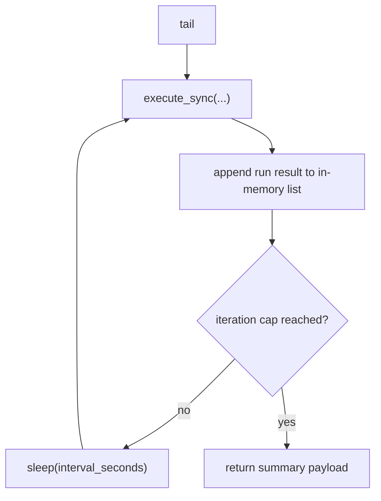
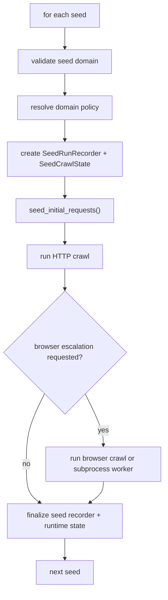
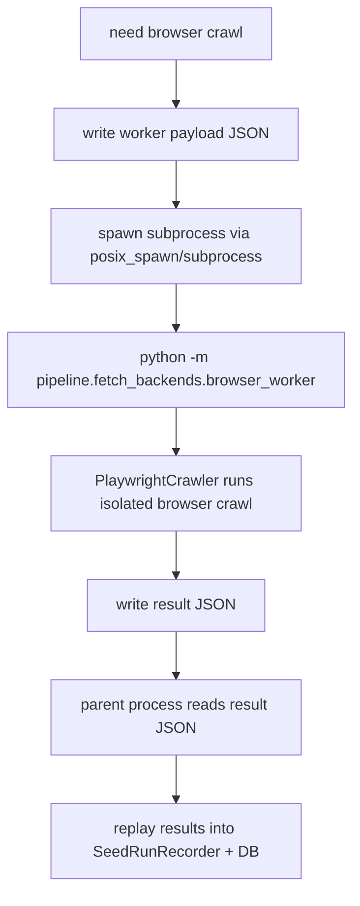

# 05 Loops, Processes, and Automation Cycles

This repo is fundamentally batch-oriented, but it still contains several important loops and process cycles.

## Loop Inventory

The meaningful repeating or cyclical behaviors are:

1. the external scheduled shell-run loop around `run_v4.sh`
2. the internal `tail` polling loop in `cli/sync.py:execute_tail`
3. the per-seed fetch queue loop in `pipeline/fetch_backends/crawlee_backend.py`
4. the fetch self-healing loop inside `SeedCrawlState`
5. the browser worker subprocess lifecycle in `pipeline/fetch_backends/browser_worker.py`
6. the inbound discovery intake cycle in `PipelineRunner._intake_inbound_discovery_seeds`
7. the change-diff cycle in `jobs/export_changes.py`

There is no internal cron scheduler, no durable distributed worker queue, and no event-bus subscriber loop.

## External Automation Cycle: `run_v4.sh`

### Where it starts

- `run_v4.sh`
- usually invoked manually or by an external scheduler such as cron or launchd

### Inputs

- environment variables
- `crawler_config.json`
- `seeds.csv`
- optional `data/inbound/discoveries_inbound.csv`

### Decisions

- whether a lock already exists
- whether to bootstrap schema ingestion
- which crawl mode and limits to use
- whether to pass fetch-related overrides

### Outputs

- CLI crawl run
- change diff artifacts
- rewritten manifest
- segment guardrail pass/fail result

### Stop conditions

- lock already held
- missing Python 3.11
- missing seed file
- CLI failure
- segment guardrail failure

### Safeguards

- lock file or `flock`
- shell `set -euo pipefail`
- manifest write at the end
- post-run dispensary-only validation

## Internal Polling Loop: `tail`

### Where it starts

- `cli/sync.py:execute_tail`

### Trigger

- `cannaradar_cli.py tail`

### Behavior

### Inputs

- same inputs as `sync`
- `--interval-seconds`
- optional `--iterations`

### Decisions

- whether to keep looping

### Outputs

- repeated sync runs
- aggregated run summaries in the final response

### Failure behavior

There is no special retry wrapper inside `tail`. If `execute_sync` raises, the command fails.

## Discovery Intake Cycle

### Where it starts

- `pipeline/pipeline.py:PipelineRunner._intake_inbound_discovery_seeds`

### Trigger

- discovery stage during `sync`

### Inputs

- `data/inbound/discoveries_inbound.csv`
- current `discoveries.csv`
- active domains from the DB

### Decisions

- skip missing website rows
- skip rows whose domain is already active
- skip rows already present in discovery file

### Outputs

- updated `discoveries.csv`
- cleared inbound file
- intake stats in run-state

### Cycle pattern

This is a queue-drain cycle. The inbound CSV is treated as a one-way pending queue and is emptied after successful intake.

## Per-Seed Fetch Queue Loop

### Where it starts

- `pipeline/fetch_backends/crawlee_backend.py:run_fetch`

### Trigger

- fetch stage in `sync`

### Inputs

- a list of `DiscoverySeed`
- config limits
- domain policy
- run-control JSON
- DB cache and telemetry

### Core loop

### Repeating behavior inside the seed loop

The queue loop is managed by Crawlee request handlers:

- requests are seeded from the homepage plus `cfg.extra_paths`
- HTML responses call `enqueue_links_from_html`
- new same-domain URLs are queued if they pass filters and depth/budget checks
- the loop stops when the request budget is exhausted, the queue is empty, or a stop condition fires

### Stop conditions

- page budget reached
- total budget reached
- domain stop requested
- seed quarantined
- blocked storm
- DNS failure
- repeated not-found storm
- browser escalation request halts HTTP crawl early

## Fetch Self-Healing Loop

This is one of the most important recurring control loops in the system.

### Where it lives

- `pipeline/fetch_backends/crawlee_backend.py:SeedCrawlState.observe_failure`
- `SeedCrawlState.refresh_controls`
- `SeedCrawlState.persist_runtime`

### What it does

On each failure, the fetch layer:

- classifies the failure kind
- increments per-kind counters
- increments per-prefix counters
- auto-suppresses noisy prefixes after repeated failures
- auto-quarantines seeds on DNS failure
- auto-stops domains after blocked storms
- auto-disables discovery after repeated 404 churn
- polls agent controls from the control JSON
- persists runtime metrics back into the control JSON

### Timing behavior

This is a poll-based loop, not event driven:

- runtime controls are refreshed every `0.75s`
- runtime state is persisted every `1.0s`

Those intervals are defined by:

- `CONTROL_REFRESH_INTERVAL_SECONDS`
- `RUNTIME_PERSIST_INTERVAL_SECONDS`

### Why it exists

It lets the crawler adapt during a run without requiring a restart for every noisy domain.

## Browser Worker Process Cycle

### Where it starts

- `pipeline/fetch_backends/crawlee_backend.py:_run_browser_crawl_dispatch`

### Trigger

- a seed’s policy mode is `browser`
- or HTTP fetch triggers browser escalation via block detection

### Lifecycle

### Inputs

- seed metadata
- config subset
- domain policy wait selector
- block patterns
- current queue items
- seen/processed URLs

### Outputs

- result JSON payload
- browser fetch results replayed into the parent process

### Why it matters

This isolates Playwright crashes from the main agent process, especially on macOS where inline browser launch previously caused parent-process instability.

## Export Change-Diff Cycle

### Where it starts

- `jobs/export_changes.py:main`

### Trigger

- explicitly invoked
- usually from `run_v4.sh`

### Inputs

- current outreach CSV
- previous snapshot CSV

### Outputs

- added/removed/modified diff CSV
- summary text file
- `data/state/last_change_metrics.json`
- updated previous snapshot baseline

### Cycle nature

This is a compare-and-promote cycle. Each run turns the latest outreach file into the next baseline snapshot.

## Loops That Do Not Exist

To make the system easier to reason about, it is useful to say what is absent:

- no background thread pool
- no heartbeat service
- no push-based event consumer
- no persistent scheduler process inside Python
- no asynchronous task queue outside Crawlee’s per-run request queue

