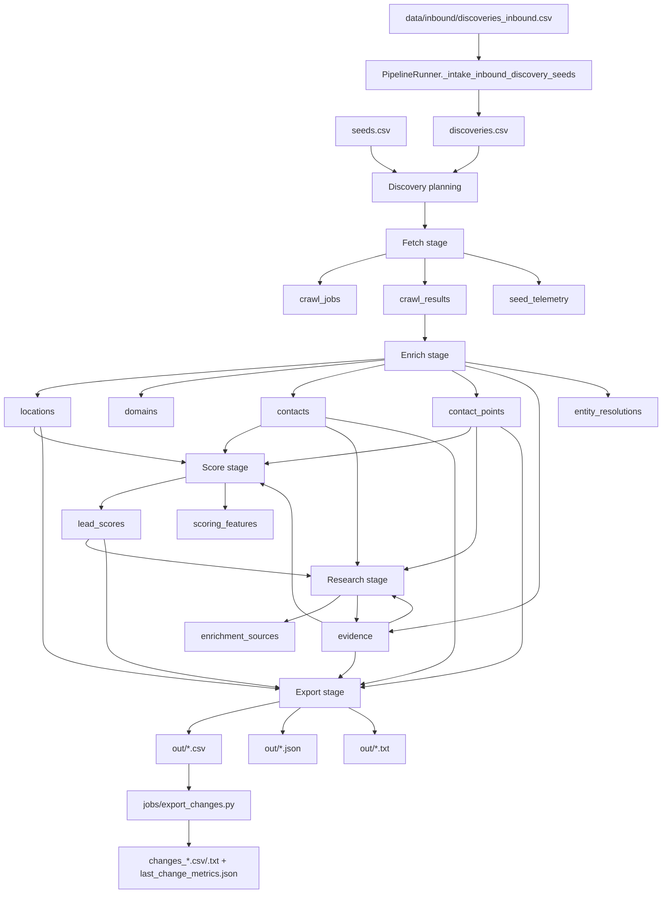

# 06 Data Flow

This document explains how data enters the system, how it is transformed, and where it is persisted.

## End-to-End Data Flow

## Input Sources

### Seed Inputs

Primary inputs:

- `seeds.csv`
- `discoveries.csv`

Optional operator-fed input:

- `data/inbound/discoveries_inbound.csv`

All seed inputs are normalized into `DiscoverySeed` objects in `pipeline/stages/discovery.py`.

### Crawl Content Inputs

The fetch layer pulls public website content through:

- `crawlee.crawlers.HttpCrawler`
- `crawlee.crawlers.PlaywrightCrawler`

There is no intermediate message queue or external crawl store.

## Persistence Points By Stage

## Discovery

Discovery does not write business entities directly. It writes:

- run-state seed lists
- optional updated `discoveries.csv` from inbound intake

It reads from:

- DB active domains
- `seed_telemetry`

## Fetch

Fetch writes:

- `crawl_jobs`
- `crawl_results`
- `seed_telemetry`

It also writes run-control runtime state to:

- `data/state/agent_runs/control_<run_id>.json`

Important detail:

`pipeline/fetch_backends/common.py:SeedRunRecorder` commits incrementally. That means fetch progress survives a crash better than stage-end-only persistence would.

## Enrich

Enrich is where raw crawl content becomes canonical lead data.

`pipeline/pipeline.py:PipelineRunner.run_enrich` writes:

- `locations`
- `domains`
- `contacts`
- `contact_points`
- `evidence`
- `entity_resolutions`

It also updates:

- `crawl_jobs.status` to `enriched`
- `locations.last_crawled_at`
- `locations.last_seen_at`

## Score

Score writes:

- `lead_scores`
- `scoring_features`
- updated `locations.fit_score`

Inputs used to compute score:

- presence of buyer-like contacts
- presence of email/phone
- menu provider signal
- multi-location signal
- enterprise-chain penalty

## Research

Research writes:

- `enrichment_sources`
- evidence fields such as:
  - `agent_research_status`
  - `agent_research_gaps`
  - `agent_research_target_roles`
  - `agent_research_suggested_paths`
  - `agent_research_recommended_action`
  - `agent_research_summary`

This is important: the agent research stage does not write a separate research table. It persists into the existing evidence/enrichment model.

## Export

Export reads from canonical tables and writes files to `out/`.

Main outputs:

- outreach-ready CSV
- legacy outreach CSV
- excluded non-dispensary CSV
- research queue CSV
- agent research queue CSV
- lead intelligence index CSV
- lead intelligence table markdown
- lead intelligence manifest JSON
- per-lead intelligence packages under `out/lead_intelligence/leads/`
- merge suggestions CSV
- new leads CSV
- buyer signal watchlist CSV
- quality report text and JSON

## Data Model By Concept

| Concept | Primary tables/files | Produced by | Consumed by |
| --- | --- | --- | --- |
| Seed candidate | `seeds.csv`, `discoveries.csv`, inbound CSV | operator/tools | discovery stage |
| Crawl execution | `crawl_jobs`, `crawl_results`, `seed_telemetry` | fetch | enrich, query/status |
| Canonical entity | `organizations`, `companies`, `locations`, `domains` | resolve/enrich | score, research, export |
| Contact surface | `contacts`, `contact_points` | parse/enrich | score, research, export |
| Proof/evidence | `evidence` | parse/enrich/research | score, export, query |
| Scoring | `lead_scores`, `scoring_features` | score | research, export |
| Research summary | `enrichment_sources`, research evidence fields | research | export/query |
| Outreach feedback | `outreach_events` | `jobs/log_outreach_event.py` | not materially consumed today |

## Control and Metadata Flow

Not all important data is business data. The run-control and run-state files drive automation and recovery:

- `run_<run_id>.json` stores stage completion, recovery pointer, seed plans, and final summary/report.
- `control_<run_id>.json` stores live domain runtime counters, recent interventions, and manual/automatic control overrides.
- `data/state/last_run_manifest.json` stores a summary of the latest run, but its exact payload shape varies depending on whether the latest run came from direct CLI or `run_v4.sh`.

## Data Movement Caveats

### Outputs are global to the repo, not per DB

Inferred from code:

- `pipeline/pipeline.py` writes exports to the repo-root `out/`
- `cli/query.py:run_status` reads repo-root outputs and manifest

So if you point the CLI at a temp DB, the system still writes exports to the shared repo `out/` directory.

### Research queue vs agent research queue are different

- `export_research_queue` is a simpler “missing buyer contact” queue.
- `export_agent_research_queue` is the richer brief-driven queue.

### Agent research queue vs lead intelligence packages are different

- `export_agent_research_queue` is still a flat queue for triage and follow-up ordering.
- `export_lead_intelligence_dossier` builds the per-lead package used for deeper dossier work.
- Per-lead packages are written to the shared repo `out/lead_intelligence/leads/` directory, not into the DB.
- Those packages are deterministic scaffolds plus agent handoff files; they are not themselves a new canonical table family.

### Outreach feedback is a sink today

`jobs/log_outreach_event.py` writes `outreach_events`, but there is no current code path that feeds those outcomes back into scoring or lead ranking.
