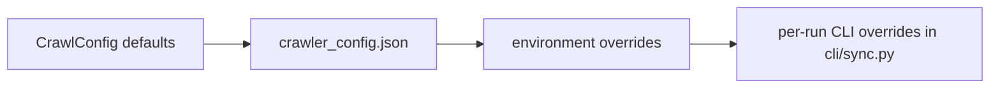

# 08 Config and Environment

## Config Sources and Precedence

The main config loader is `pipeline/config.py:load_crawl_config`.

Precedence, inferred from code:

Important nuance:

- `pipeline/config.py` applies defaults and JSON/env overrides.
- `cli/sync.py:_apply_runner_overrides` applies per-run CLI flag overrides after the `PipelineRunner` is created.

## Main Config File

Default path:

- `crawler_config.json`

Resolved by:

- `cli/doctor.py:resolve_config_path`
- `pipeline/config.py:load_crawl_config`

If relative paths are used inside the JSON, `CrawlConfig.resolve_runtime_path` resolves them relative to the config file location, not necessarily the repo root.

## Key Config Groups

## Crawl Behavior

Fields in `pipeline/config.py:CrawlConfig`:

- `timeout_seconds`
- `max_retries`
- `retry_delay_seconds`
- `crawl_delay_seconds`
- `max_depth`
- `max_pages_per_domain`
- `max_total_pages`
- `respect_robots`
- `allowed_schemes`
- `denylist`
- `max_concurrency`
- `cache_ttl_hours`

Used by:

- fetch backend
- seed planning
- caching/skip logic

## Discovery and Monitoring

Fields:

- `seed_file`
- `discovery_seed_file`
- `monitor_stale_days`
- `monitor_max_pages_per_domain`
- `monitor_max_total_pages`
- `monitor_max_depth`
- `growth_max_pages_per_domain`
- `growth_max_total_pages`
- `growth_max_depth`

Used by:

- `PipelineRunner._discovery_stage`
- `PipelineRunner._monitoring_stage`
- `cli/sync.py`

## Growth and Reliability Gates

Fields:

- `weekly_new_lead_target`
- `growth_window_days`
- `enforce_growth_governor`
- `seed_failure_streak_limit`
- `seed_backoff_hours`
- `require_fetch_success_gate`
- `require_net_new_gate`
- `fail_on_zero_new_leads`
- `output_stale_hours`

Used by:

- `PipelineRunner._growth_governor`
- `PipelineRunner._is_seed_in_backoff`
- `PipelineRunner._run_reliability_gate`
- `PipelineRunner._evaluate_net_new_gate`

## Agent Research

Fields:

- `agent_research_enabled`
- `agent_research_limit`
- `agent_research_min_score`
- `agent_research_paths`

Used by:

- `pipeline/stages/research.py`
- `pipeline/stages/export.py:export_agent_research_queue`
- `cli/sync.py`

## Crawlee and Browser Behavior

Fields:

- `crawlee_headless`
- `crawlee_browser_type`
- `crawlee_proxy_urls`
- `crawlee_use_session_pool`
- `crawlee_retry_on_blocked`
- `crawlee_max_session_rotations`
- `crawlee_viewport_width`
- `crawlee_viewport_height`
- `crawlee_max_browser_pages_per_domain`
- `crawlee_browser_isolation`
- `crawlee_extra_block_patterns`
- `crawlee_domain_policies_file`

Used by:

- `pipeline/fetch_backends/crawlee_backend.py`
- `pipeline/fetch_backends/browser_worker.py`

## `fetch_policies.json`

Loaded by:

- `pipeline/fetch_backends/domain_policy.py:load_domain_policies`

Policy capabilities:

- `mode`: `http_then_browser_on_block`, `browser`, `http_only`
- `waitForSelector`
- `extraBlockPatterns`
- `maxPagesPerDomain`
- `maxDepth`
- `browserOnBlock`

Current repo default:

- no domain-specific overrides
- default is HTTP-first with browser-on-block enabled

## Environment Variables

The code and runbook support these important env vars:

### Config and seed selection

- `CANNARADAR_CRAWLER_CONFIG`
- `CANNARADAR_SEED_FILE`
- `CANNARADAR_DISCOVERY_FILE`
- `CANNARADAR_DENYLIST`
- `CANNARADAR_MAX_SEEDS`

### Discovery/governor behavior

- `CANNARADAR_SEED_FAILURE_STREAK_LIMIT`
- `CANNARADAR_SEED_BACKOFF_HOURS`
- `CANNARADAR_WEEKLY_NEW_LEAD_TARGET`
- `CANNARADAR_GROWTH_WINDOW_DAYS`
- `CANNARADAR_ENFORCE_GROWTH_GOVERNOR`
- `CANNARADAR_REQUIRE_FETCH_SUCCESS_GATE`
- `CANNARADAR_REQUIRE_NET_NEW_GATE`
- `CANNARADAR_FAIL_ON_ZERO_NEW_LEADS`
- `CANNARADAR_OUTPUT_STALE_HOURS`

### Agent research

- `CANNARADAR_AGENT_RESEARCH`
- `CANNARADAR_AGENT_RESEARCH_LIMIT`
- `CANNARADAR_AGENT_RESEARCH_MIN_SCORE`

### Fetch/browser

- `CANNARADAR_CRAWLEE_HEADLESS`
- `CANNARADAR_CRAWLEE_PROXY_URLS`
- `CANNARADAR_CRAWLEE_MAX_BROWSER_PAGES_PER_DOMAIN`
- `CANNARADAR_CRAWLEE_BROWSER_ISOLATION`
- `CANNARADAR_CRAWLEE_DOMAIN_POLICIES_FILE`

### Wrapper script behavior

- `CANNARADAR_RUN_CANONICAL_INGEST`
- `CANNARADAR_CRAWL_MODE`
- `CANNARADAR_DISCOVERY_LIMIT`
- `CANNARADAR_MONITOR_LIMIT`
- `CANNARADAR_MONITOR_STALE_DAYS`
- `CANNARADAR_GROWTH_MAX_PAGES_PER_DOMAIN`
- `CANNARADAR_GROWTH_MAX_TOTAL_PAGES`
- `CANNARADAR_GROWTH_MAX_DEPTH`
- `CANNARADAR_MONITOR_MAX_PAGES_PER_DOMAIN`
- `CANNARADAR_MONITOR_MAX_TOTAL_PAGES`
- `CANNARADAR_MONITOR_MAX_DEPTH`

## CLI Overrides

`cli/app.py:_add_sync_args` exposes a subset of config as per-run overrides.

Most important ones:

- `--crawl-mode`
- `--max`
- `--growth-max-pages`
- `--growth-max-total`
- `--growth-max-depth`
- `--monitor-max-pages`
- `--monitor-max-total`
- `--monitor-max-depth`
- `--agent-research`
- `--agent-research-limit`
- `--agent-research-min-score`
- `--crawlee-headless`
- `--crawlee-proxy-urls`
- `--crawlee-max-browser-pages`
- `--crawlee-browser-isolation`
- `--crawlee-domain-policies-file`

## Environment and Path Dependencies

### Python

- Python 3.11+ is required by CLI and Crawlee runtime.

### Browser runtime

- `playwright install chromium` must have been run.

### DB path

The CLI supports `--db`, but some repo-global outputs do not follow the DB path.

### Output and manifest paths

Hard-coded repo-root paths include:

- `pipeline/pipeline.py:OUT_DIR`
- `pipeline/pipeline.py:MANIFEST_PATH`
- `cli/query.py:MANIFEST_PATH`
- `cli/query.py:OUT_DIR`

This means output files and status snapshots are shared across runs unless the code is changed.

## Practical Config Advice

If you are changing behavior:

- change `crawler_config.json` for default runtime policy
- change `fetch_policies.json` for domain-specific fetch behavior
- use CLI overrides for one-off runs
- use env vars when driving the system from `run_v4.sh` or an external scheduler

