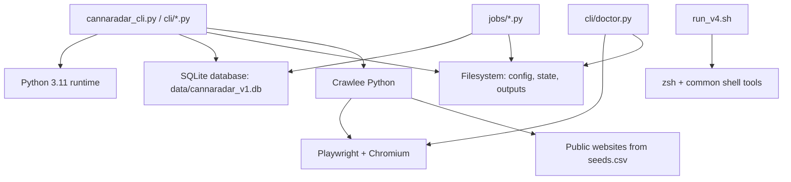

# 09 External Dependencies

This document explains what CannaRadar depends on outside its own Python modules, how those dependencies are used, and which ones are required for the main runtime versus support utilities.

The short version is: CannaRadar is mostly local. Its main runtime depends on Python 3.11, SQLite, Crawlee, Playwright, the local filesystem, and the public websites being crawled. It does not depend on a hosted application server, a queue broker, a cloud database, or a required LLM API.

## Dependency Model

## Required Runtime Dependencies

### Python 3.11

The canonical CLI refuses older Python versions in `cli/app.py:_require_python_311`. The shell wrapper `run_v4.sh` also hard-codes `python3.11`.

Why it matters:

- the Crawlee runtime in `requirements.txt` is only declared for Python 3.11+
- browser handling and async behavior were hardened around the current Python 3.11 environment
- the `doctor` command checks this first in `cli/doctor.py:run_doctor`

### SQLite

SQLite is the system of record. The main database defaults to `data/cannaradar_v1.db`, and schema bootstrap/validation comes from:

- `pipeline/db.py`
- `db/schema.sql`
- `jobs/ingest_sources.py:init_db`
- `jobs/ingest_sources.py:assert_schema_layout`
- `jobs/ingest_sources.py:assert_schema_migration`

This is not a cache. It is the canonical persistence layer for crawl jobs, crawl results, locations, evidence, contacts, scores, research metadata, and outreach logging.

### Crawlee

The fetch subsystem depends on Crawlee through `pipeline/fetch_backends/crawlee_backend.py` and `pipeline/fetch_backends/browser_worker.py`.

Crawlee is responsible for:

- HTTP crawling
- Playwright-backed browser crawling
- request queue management
- session management and retry behavior
- robots handling at the crawler layer

What calls it:

- `pipeline/stages/fetch.py`
- `pipeline/pipeline.py:PipelineRunner.run_fetch`
- ultimately `cli/sync.py:execute_sync`

### Playwright and Chromium

Browser escalation depends on Playwright. `cli/doctor.py:run_doctor` actively checks whether Chromium is installed via `playwright install chromium`.

Why this matters:

- HTTP-first crawling works without the browser path for many sites
- browser escalation is required for JS-heavy or blocked sites
- on macOS, browser execution is isolated by default via `pipeline/config.py:CrawlConfig.crawlee_browser_isolation = "subprocess"` to contain Playwright crashes

## Network Dependencies

### Public websites under crawl

The system’s most important external dependency is the public web itself. Seed input comes from files such as `seeds.csv`, and fetch behavior targets those domains.

What CannaRadar expects from the external web:

- public HTML pages
- same-domain link traversal
- optionally renderable browser pages for JS-heavy sites
- robots and access-control signals that can be detected and handled

What the code assumes:

- crawling is public-page oriented
- success is not guaranteed for every domain
- blocked or hostile domains are normal and should be recorded rather than treated as exceptional architecture failures

## Filesystem Dependencies

The local filesystem is part of the runtime architecture, not just packaging.

Important paths:

- `crawler_config.json`
- `fetch_policies.json`
- `seeds.csv`
- `discoveries.csv`
- `data/inbound/discoveries_inbound.csv`
- `data/state/agent_runs/`
- `data/state/last_run_manifest.json`
- `out/`

What uses these paths:

- `pipeline/config.py:load_crawl_config`
- `pipeline/run_state.py`
- `pipeline/run_control.py`
- `pipeline/pipeline.py`
- `cli/query.py:run_status`
- `run_v4.sh`

The `doctor` command treats writable filesystem state as a first-class dependency because the pipeline cannot function without it.

## Shell and OS Dependencies

`run_v4.sh` assumes a Unix-like shell environment and depends on:

- `zsh`
- `python3.11`
- optionally `flock`

If `flock` is unavailable, the script falls back to a timestamp-based lock-file strategy in `data/state/run_v4.lock`.

This means the wrapper is operationally useful, but it is not the same thing as the Python CLI. It adds shell-level locking and post-run bookkeeping on top of the canonical runtime.

## Optional or Support-Only Dependencies

### Source adapters

`jobs/ingest_sources.py` uses `adapters/registry.py` and currently only enables `adapters/seeds_adapter.py`.

This adapter layer is not part of the main crawl path. It is a support/bootstrap path for loading seed-like rows into the canonical DB.

Inferred from code:

- the adapter system is intended for future ingestion sources
- today it is deliberately minimal and local-only

### Outreach logging

`jobs/log_outreach_event.py` writes to `outreach_events`. This is an internal utility, not a service integration.

There is no CRM, email service, or dialer integration in this repo.

### Change reporting

`jobs/export_changes.py` compares the current `outreach_dispensary_100.csv` export to a previous snapshot and writes change reports.

This is a local diff tool, not an external notification system.

## Dependencies That Do Not Exist

These patterns were explicitly looked for and were not found in the current repo:

- no HTTP server
- no background daemon process started by the app itself
- no Redis
- no Kafka or RabbitMQ
- no cloud database
- no hosted vector database
- no required auth token for the main crawl pipeline
- no required LLM or prompt API in the main runtime path
- no internal planner/reasoner loop that calls external tools during a crawl run

Important clarification:

The repo uses the word "agent" in its CLI, runbook, and docs, but the implementation is mostly about agent-operability, resumability, and control surfaces. The `research` stage in `pipeline/stages/research.py` is rule-based synthesis over stored evidence, not an LLM-driven web research agent.

## Operational Dependency Boundaries

The dependencies split into three practical groups.

### Hard requirements for `doctor -> sync -> export`

- Python 3.11
- SQLite
- config and policy files
- writable state/output directories
- Crawlee
- public seed domains

### Required for browser-escalated coverage

- Playwright
- Chromium
- a working subprocess/browser-launch environment

### Helpful but not strictly required

- `run_v4.sh`
- `jobs/export_changes.py`
- `jobs/log_outreach_event.py`
- adapter bootstrap scripts

## Where To Change Dependency Behavior

- Runtime package dependencies: `requirements.txt`
- Python version gate: `cli/app.py:_require_python_311`
- Browser dependency checks: `cli/doctor.py:run_doctor`
- Config and path resolution: `pipeline/config.py`
- Browser isolation strategy: `pipeline/config.py` and `pipeline/fetch_backends/crawlee_backend.py:_resolved_browser_isolation`
- Shell wrapper assumptions: `run_v4.sh`

## Known Unknowns

- Assumption: the repo is intended to stay local-first rather than evolve into a hosted service. This is strongly suggested by the CLI-first architecture, but it is still a product decision rather than a technical necessity.
- Inferred from code: the adapter system is a future expansion point, but only one local adapter is implemented today, so the intended long-term ingestion model is not fully defined in the repo.
