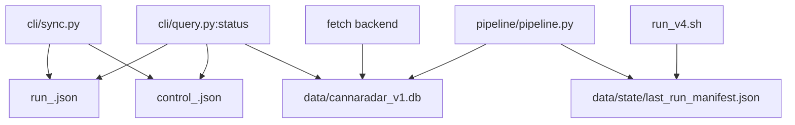
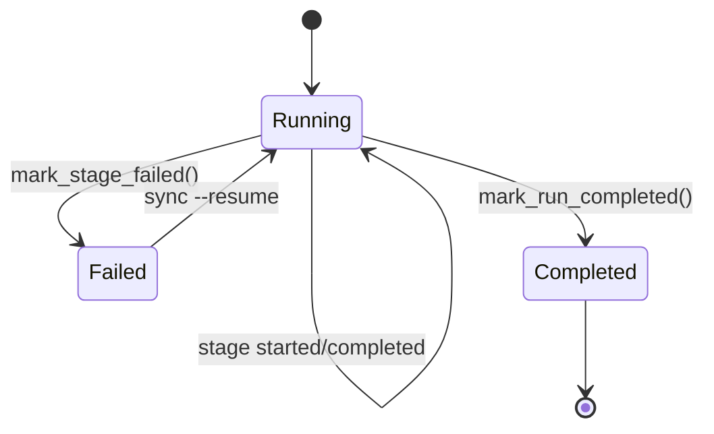
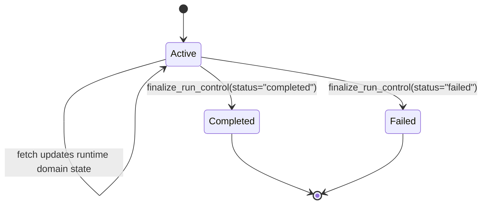
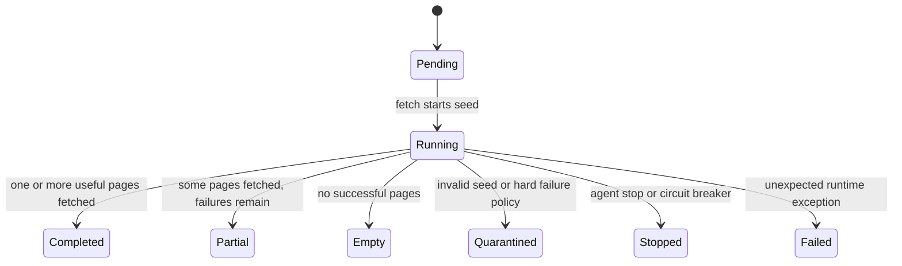
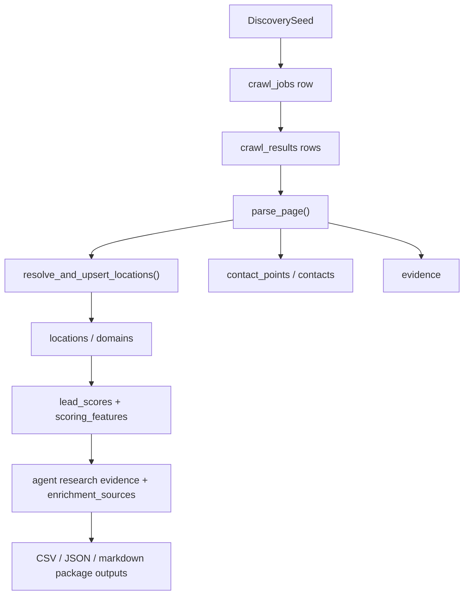

# 10 State and Lifecycle

This document explains how CannaRadar represents run state, crawl state, and entity state over time.

There are three different state systems in this repo:

1. canonical business data in SQLite
2. resumable run/checkpoint state in `data/state/agent_runs/run_<id>.json`
3. live intervention/runtime state in `data/state/agent_runs/control_<id>.json`

You need all three to reason about the system correctly.

## State Layers

## Run Lifecycle

### Run creation

The top-level run lifecycle starts in `cli/sync.py:execute_sync`.

That function:

- resolves a `run_id`
- creates or loads checkpoint state via `pipeline/run_state.py`
- creates or loads run-control state via `pipeline/run_control.py`
- decides whether the run is a new run or a resumed run
- marks stages started/completed/failed as work advances

Checkpoint state is versioned as `run_state.v1` in `pipeline/run_state.py`.

### Stage lifecycle

The checkpoint file tracks a fixed stage order:

- `discovery`
- `fetch`
- `enrich`
- `score`
- `research`
- `export`

That ordering is defined in `pipeline/run_state.py:STAGE_ORDER`.

Each stage has:

- `status`
- `started_at`
- `completed_at`
- `details`

Allowed observed statuses in practice:

- `pending`
- `running`
- `completed`
- `failed`

The checkpoint also stores a `recovery_pointer`, which is the next unfinished stage. That is what resumability is built around.

## Run State Diagram

## Checkpoint State Contents

`pipeline/run_state.py:create_run_state` creates a payload with these important fields:

- run metadata: `run_id`, `command`, `db_path`, `config_path`, `seeds_path`, `crawl_mode`
- recovery metadata: `recovery_pointer`
- seed-planning metadata: `seed_counts`, `seed_intake`, `governor`, `export_since`
- stage state: `stages`
- final output summaries: `summary`, `report`
- last error: `last_error`

Why this matters:

- the checkpoint is not just a crash marker
- it is the authoritative record of what a resumable agent run thinks happened

## Live Run Control Lifecycle

Run control is separate from stage checkpoints. It is defined in `pipeline/run_control.py`.

Purpose:

- represent runtime crawl state per domain
- persist agent interventions
- let the fetch subsystem poll and apply bounded controls while the run is live

Schema version: `run_control.v1`

Top-level state:

- `status`: usually `active`, then finalized to `completed` or `failed`
- `agent_controls.domains`
- `runtime.current_seed_domain`
- `runtime.domains`
- `runtime.interventions`

### Agent control state

Per-domain manual controls include:

- `quarantined`
- `quarantine_reason`
- `suppressed_path_prefixes`
- `max_pages_per_domain`
- `stop_requested`

These are written through `cli/control.py` and consumed by the fetch backend.

### Runtime state

Per-domain runtime records include:

- `status`
- `processed_urls`
- `success_pages`
- `failure_pages`
- `filtered_urls`
- `last_status_code`
- `last_error`
- `discovery_enabled`
- `browser_escalated`

This is operational state, not business state.

## Control State Diagram

## Crawl Job and Seed Lifecycle

At the database level, seed/domain execution is tracked through:

- `crawl_jobs`
- `crawl_results`
- `seed_telemetry`

The main writer is `pipeline/fetch_backends/common.py:SeedRunRecorder`.

That recorder tracks:

- one `crawl_jobs` row per seed/domain run
- zero or more `crawl_results` rows for fetched pages
- one `seed_telemetry` summary update per seed/domain run

## Seed Runtime State Diagram

Observed notes:

- the exact status strings are not managed by a single enum file; they emerge from fetch recording logic and summary tables
- `seed_telemetry` is the best place to understand domain health across runs

## Business Entity Lifecycle

The business lifecycle is different from the run lifecycle.

The main entity path is:

1. seed domain identified
2. crawl pages fetched
3. parsed contacts/signals extracted
4. location resolved/upserted
5. evidence/contact points/contacts written
6. location scored
7. lead brief synthesized
8. export rows produced

This lifecycle is mainly implemented across:

- `pipeline/stages/discovery.py`
- `pipeline/fetch_backends/common.py`
- `pipeline/pipeline.py:run_enrich`
- `pipeline/stages/score.py`
- `pipeline/stages/research.py`
- `pipeline/stages/export.py`

## Business Entity Flow Diagram

## Manifest Lifecycle

`data/state/last_run_manifest.json` is not the same thing as the checkpoint.

It is written by:

- `pipeline/pipeline.py:_write_last_run_manifest`
- `cli/sync.py` during stage progress and failure handling
- `run_v4.sh`, which rewrites it with a wrapper-level payload after the CLI run finishes

This is important because the manifest has two personalities:

- direct CLI run: pipeline-oriented report
- `run_v4.sh` run: shell-wrapper report with git/config/count metadata

Inferred from code:

`cli/query.py:run_status` treats the manifest as a status snapshot, but its shape depends on how the last run was executed.

## Resume Semantics

Resumability is stage-based, not mid-function replay.

What `sync --resume` does:

- load the checkpoint
- inspect `recovery_pointer`
- skip completed stages
- rerun the next incomplete stage and onward

What it does not do:

- recreate in-memory fetch queues exactly where they were
- restore a half-finished HTTP request
- resume browser navigation inside a page

That is by design. The recoverable unit is the stage, not the individual network request.

## Relationship Between Runtime State and Persistence

The practical model is:

- run state says what the orchestrator believes the run has completed
- run control says what the active fetch loop is doing and what interventions have been applied
- SQLite holds the durable outputs that survive process death

When these disagree, trust order should usually be:

1. SQLite for durable business facts
2. checkpoint for orchestration truth
3. control state for live operational hints
4. manifest for operator-friendly summary

## Known Unknowns

- Inferred from code: `run_v4.sh` overwrites the manifest with a reduced wrapper payload, so some pipeline fields may be lost or flattened after wrapper-based runs.
- Inferred from code: stage-level resumability is explicit, but there is no formal schema-enforced enum for all crawl-job status values; some operational states are effectively conventions rather than a single source of truth.
