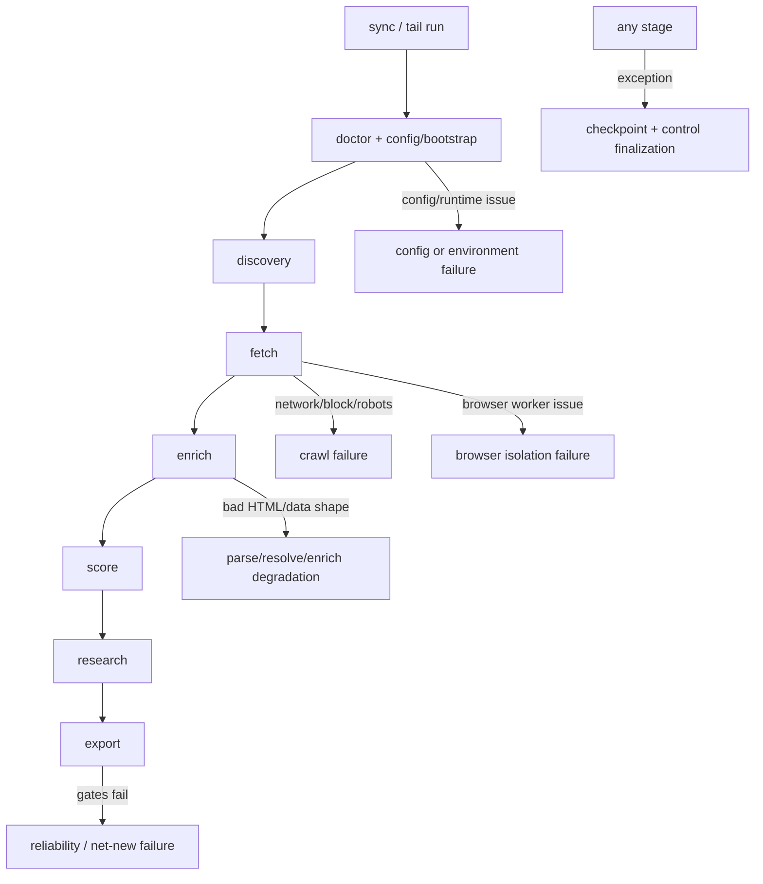
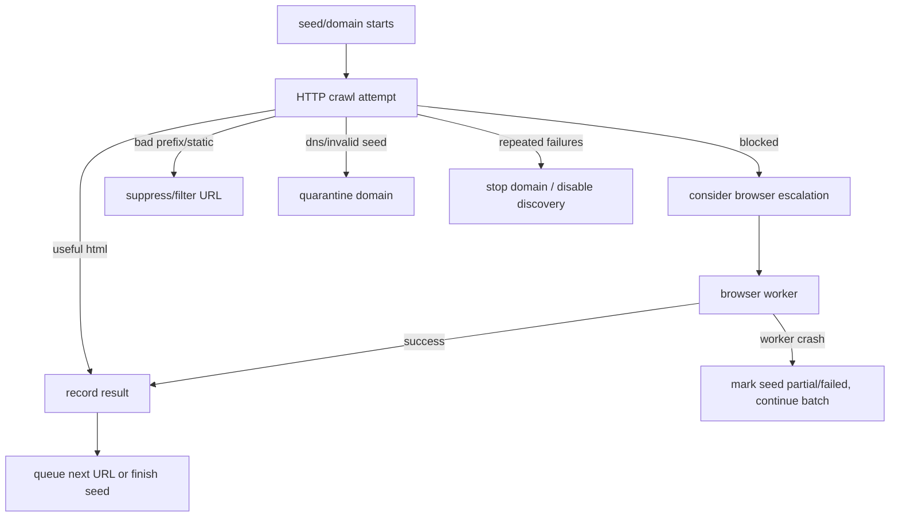

# 11 Failure Modes and Recovery

This document explains how the system fails, how it classifies failures, what gets retried, what gets quarantined, and where an engineer should look first when something goes wrong.

The repo is intentionally built around the idea that failure is normal in crawling. The important question is not "can it fail?" but "does it fail in a way the agent and operator can diagnose and recover from?"

## Failure Surface Map

## CLI-Level Failure Semantics

Error classes and exit codes are defined in `cli/errors.py`.

Stable exit code families:

- `0`: success
- `2`: usage error
- `10`: config error
- `11`: auth error
- `12`: network error
- `13`: data validation error
- `14`: storage error
- `15`: resume state error
- `16`: runtime error
- `17`: command failed

What classifies them:

- `cli/errors.py:classify_exception`
- `cli/app.py:main`

This matters because automation should key off the exit code first, not string parsing.

## Preflight Failures

The first line of defense is `cli/doctor.py:run_doctor`.

Typical preflight failures:

- wrong Python version
- missing `crawler_config.json`
- broken config JSON
- missing `fetch_policies.json`
- unwritable DB/output/state directories
- broken or drifted schema
- missing Crawlee install

Typical preflight warnings:

- Playwright not installed
- missing optional seed/discovery input files
- low disk space

Recovery:

- run `init`
- fix config paths
- install dependencies
- run schema bootstrap via `jobs/ingest_sources.py`

## Discovery-Stage Failure Modes

Discovery is relatively simple compared with fetch.

Things that can go wrong:

- seed file missing or unreadable
- malformed rows
- inbound discoveries that duplicate existing active domains
- seeds skipped because of backoff in `seed_telemetry`
- growth governor reducing discovery volume

Relevant code:

- `pipeline/stages/discovery.py`
- `pipeline/pipeline.py:_build_seed_plan`
- `pipeline/pipeline.py:_is_seed_in_backoff`
- `pipeline/pipeline.py:_growth_governor`

Recovery behavior:

- malformed rows are skipped rather than fatal when possible
- discovery limits are reduced by the governor rather than causing hard failure
- backoff excludes unstable seeds temporarily instead of blocking the whole run

## Fetch-Stage Failure Modes

Fetch is the most failure-heavy part of the system.

### Common fetch failures

- invalid seed URL
- DNS failure
- robots exclusion
- 401/403/429/503 block responses
- block markers in HTML such as "captcha" or "access denied"
- low-value URL churn on static or CMS paths
- browser launch failures
- browser worker crashes
- page timeouts
- empty HTML bodies

Relevant code:

- `pipeline/fetch_backends/common.py`
- `pipeline/fetch_backends/crawlee_backend.py`
- `pipeline/fetch_backends/browser_worker.py`
- `pipeline/fetch_backends/domain_policy.py`

### Block detection

Block detection is centralized in `pipeline/fetch_backends/common.py:detect_block_signal`.

It treats these as blocked:

- status codes `401`, `403`, `429`, `503`
- content markers such as `captcha`, `verify you are human`, `access denied`, `attention required`, `cloudflare`, `akamai`
- optional extra patterns from config/domain policy

### Self-healing in fetch

Fetch does not just retry blindly. It also changes behavior.

Self-healing mechanisms include:

- static-path and static-extension filtering
- low-value path filtering
- per-domain suppressed path prefixes
- domain-level page caps
- browser escalation only when block/failure signals warrant it
- quarantine for hard-invalid seeds or repeated fatal cases
- stop requests via run control

This behavior is driven by `SeedCrawlState` in `pipeline/fetch_backends/crawlee_backend.py`.

## Fetch Recovery Loop

## Browser Failure Containment

This repo had a concrete macOS browser crash problem, and the current code is designed around containing it.

Important behavior:

- browser isolation mode defaults to `subprocess` on macOS in `pipeline/config.py`
- `pipeline/fetch_backends/crawlee_backend.py:_spawn_browser_worker` launches `python -m pipeline.fetch_backends.browser_worker`
- browser failure is supposed to stay seed-local rather than kill the parent batch

Why this matters:

- browser crawling is still valuable
- inline Playwright failures are not trusted enough on macOS
- subprocess isolation is the compromise that preserves browser capability while protecting the main run

Recovery when browser fails:

- record the failure
- preserve status hints where possible
- continue the overall run
- allow resume and intervention rather than crashing the entire process

## Persistence and Crash Recovery

Fetch durability is intentionally incremental.

The `SeedRunRecorder` in `pipeline/fetch_backends/common.py` writes progress during fetch rather than only at stage end.

That means a crash should still leave behind:

- `crawl_jobs` rows
- `crawl_results` rows that already succeeded
- `seed_telemetry` updates at seed finalization

This does not make fetch request-level resumable, but it does prevent catastrophic loss of all progress from a late-stage failure.

## Stage Failure and Resume Behavior

When `execute_sync` catches an exception in `cli/sync.py`, it:

- marks the current stage failed in checkpoint state
- saves checkpoint state
- finalizes run-control state as failed
- re-raises into CLI error classification

Recovery is then usually:

1. inspect `status --json`
2. inspect `control --json show`
3. inspect `recent_failures` or `seed_telemetry`
4. optionally apply bounded `control` actions
5. run `sync --resume latest`

## Gate Failures

Not every failure is a crash. Some failures are policy failures.

Two important gates exist in `pipeline/pipeline.py`:

- reliability gate
- net-new gate

### Reliability gate

This gate asks whether fetch was productive enough relative to the seeds attempted.

If it fails and `require_fetch_success_gate` is on, the run is marked failed.

### Net-new gate

This gate asks whether the run produced any new leads.

If `require_net_new_gate` and `fail_on_zero_new_leads` are configured, a zero-net-new run can become a hard failure.

These are business-policy failures, not technical crashes.

## Query and SQL Failure Modes

The read-only query surface can fail in constrained ways.

Examples:

- missing DB file
- malformed JSON manifest/checkpoint
- write SQL passed to `sql`

Safeguards:

- `cli/query.py:_connect_readonly` opens SQLite in `mode=ro`
- `cli/query.py:_validate_readonly_query` only allows `SELECT` or `WITH`
- forbidden write terms are explicitly blocked

## Shell Wrapper Failure Modes

`run_v4.sh` introduces its own operational failure cases:

- no `python3.11`
- stale or active lock file
- missing seed file
- wrapper post-processing failure after the main CLI run
- segment guardrail failure for outreach CSV content

Important subtlety:

`run_v4.sh` can succeed at the CLI layer and still fail in wrapper post-processing, because it also runs `jobs/export_changes.py` and rewrites the manifest.

## Human and Agent Recovery Playbook

The intended triage order is:

1. `doctor`
2. `status --json`
3. inspect checkpoint stage and `last_error`
4. inspect `recent_failures`
5. inspect `control --json show`
6. quarantine or cap problem domains if needed
7. `sync --resume latest`

This matches the repo’s agent-operable design: diagnose from structured state, apply bounded intervention, resume instead of restarting from scratch.

## Where To Change Recovery Behavior

- error classification and exit codes: `cli/errors.py`
- preflight policy: `cli/doctor.py`
- sync failure handling and resume rules: `cli/sync.py`
- checkpoint schema and stage model: `pipeline/run_state.py`
- live intervention state: `pipeline/run_control.py`
- fetch retries, quarantine, filtering, and browser escalation: `pipeline/fetch_backends/crawlee_backend.py`
- block-signal classification: `pipeline/fetch_backends/common.py`
- business gates: `pipeline/pipeline.py`

## Known Unknowns

- Inferred from code: the precise fetch-job status vocabulary is spread across multiple code paths rather than defined in a single enum, so some downstream interpretation still depends on convention.
- Assumption: browser isolation has solved the most serious batch-killing failure mode on the current macOS setup, but the codebase itself does not yet include a long-run soak test proving this over larger unattended batches.
