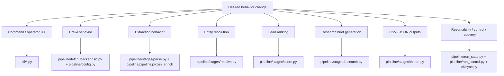

# 12 How To Modify the System

This document is the "change map" for new engineers. It tells you where to make changes based on the behavior you want to alter, what those code paths depend on, and what you can break if you change them carelessly.

The shortest useful mental model is:

- `cli/` controls how runs are invoked and observed
- `pipeline/pipeline.py` controls stage orchestration
- `pipeline/fetch_backends/crawlee_backend.py` controls crawl behavior
- `pipeline/pipeline.py:run_enrich` is where raw pages become structured entities
- `pipeline/stages/score.py` decides lead priority
- `pipeline/stages/research.py` decides what still needs follow-up
- `pipeline/stages/export.py` controls operator-facing deliverables

## Change Map

## If You Want To Change Command Behavior

Start in:

- `cli/app.py`
- `cli/sync.py`
- `cli/query.py`
- `cli/control.py`
- `cli/doctor.py`
- `cli/output.py`

Use this area for:

- new commands
- new flags
- output schema changes
- JSON/plain rendering changes
- new agent control actions
- new status/search/sql surfaces

What calls it:

- `cannaradar_cli.py`
- users, operators, automation wrappers, and agents

What it calls:

- `PipelineRunner`
- checkpoint/control helpers
- read-only DB queries
- export helpers

Risk:

- changing CLI payload shapes can break agent automation even when core pipeline logic is fine

## If You Want To Change Crawl Breadth, Depth, or Politeness

Start in:

- `pipeline/config.py`
- `crawler_config.json`
- `fetch_policies.json`
- `pipeline/fetch_backends/crawlee_backend.py`
- `pipeline/fetch_backends/domain_policy.py`

Use this area for:

- per-domain page caps
- crawl depth
- extra paths
- robots behavior
- retry policy
- user agent
- headless/browser behavior
- proxy config
- domain-specific browser forcing or browser-on-block policy

Important rule:

Prefer changing config or domain policy before changing crawler code if the behavior is a runtime tuning problem rather than a missing capability.

## If You Want To Change URL Acceptance or Self-Healing

Start in `pipeline/fetch_backends/crawlee_backend.py`.

That file owns:

- same-domain filtering
- static path suppression
- low-value path suppression
- browser escalation decisions
- per-domain runtime control polling
- auto-quarantine and auto-stop behavior
- browser worker handoff

Also inspect:

- `pipeline/fetch_backends/common.py` for block detection and status handling
- `pipeline/fetch_backends/browser_worker.py` for isolated browser execution

Use this area for:

- better handling of CMS junk paths
- better block classification
- browser crash containment
- domain circuit breakers
- new intervention heuristics

This is the highest-risk file in the repo from an operational perspective.

## If You Want To Change What Gets Extracted From HTML

Start in:

- `pipeline/stages/parse.py`
- `pipeline/pipeline.py:run_enrich`

Use this area for:

- new signal extraction
- better contact parsing
- social/menu/schema detection
- different parsing heuristics

Important nuance:

The conceptual parse stage is implemented inside `PipelineRunner.run_enrich`, not as a standalone orchestrated stage. So changing extraction behavior usually means touching both `parse.py` and the caller logic in `run_enrich`.

## If You Want To Change Entity Resolution or Deduping

Start in:

- `pipeline/stages/resolve.py`
- `pipeline/pipeline.py:run_enrich`

Use this area for:

- canonical location matching
- merge suggestion thresholds
- location/domain upsert rules
- duplicate handling

Read/write implications:

- reads parsed page objects
- writes `locations`, `domains`, `entity_resolutions`
- affects downstream scoring and exports heavily

## If You Want To Change Scoring or Tiering

Start in `pipeline/stages/score.py`.

That file is the lead-priority brain.

Use it for:

- new scoring features
- different point weights
- tier boundaries
- explainability outputs through `scoring_features`

What depends on it:

- `pipeline/stages/research.py`
- `pipeline/stages/export.py`
- `cli/query.py` search presets
- any operator workflow based on tier A/B/C

Be careful:

`lead_scores.run_id` and the sync summary logic in `cli/sync.py:_build_run_summary` are not perfectly aligned today. If you change score persistence, inspect that coupling closely.

## If You Want To Change "Agent Research"

Start in `pipeline/stages/research.py`.

Important clarification:

This is not an LLM orchestration layer. It is a deterministic brief generator that reads existing DB evidence and writes synthesized follow-up guidance back into:

- `enrichment_sources`
- `evidence`
- research export CSVs

Use this area for:

- changing what counts as research-ready
- changing gap logic
- changing target role suggestions
- changing suggested next paths
- changing recommended-action text

If you actually want external web research or an LLM-assisted enrichment loop, that is a new subsystem, not a tweak to the existing research stage.

## If You Want To Change Exports

Start in `pipeline/stages/export.py`.

Use this area for:

- outreach CSV schema
- research queue columns
- agent research queue columns
- merge suggestion exports
- buyer-signal watchlist logic
- quality report file layout

Also inspect:

- `pipeline/pipeline.py:run_export`
- `jobs/export_changes.py`
- `run_v4.sh`

Reason:

There are stable-file conventions like `out/new_leads_only.csv` and `out/callable_leads.csv`, and the wrapper script expects legacy outreach output names.

## If You Want To Change Resumability or Runtime Control

Start in:

- `pipeline/run_state.py`
- `pipeline/run_control.py`
- `cli/sync.py`
- `cli/control.py`

Use this area for:

- stage order
- checkpoint schema
- resume rules
- control commands
- run finalization behavior
- what `status` exposes

These files are the "agent-operability" brain of the repo.

## If You Want To Change Bootstrap or Schema Rules

Start in:

- `db/schema.sql`
- `jobs/ingest_sources.py`
- `pipeline/db.py`

Use this area for:

- schema changes
- migration/version validation
- bootstrapping new tables or indexes

Be careful:

`jobs/ingest_sources.py` has strict schema checks and checksum validation. If you change `db/schema.sql`, you likely also need to update the schema constants there.

## If You Want To Change Wrapper or Scheduled-Run Behavior

Start in `run_v4.sh`.

Use this area for:

- lock-file behavior
- env-var plumbing
- optional canonical ingest before sync
- change-report generation
- manifest post-processing
- segment guardrails

Important caveat:

`run_v4.sh` is not just a launcher. It mutates post-run state, especially `data/state/last_run_manifest.json`. If you change wrapper behavior, make sure you are not accidentally masking or discarding pipeline-level manifest fields you still need.

## Safe Modification Strategy

If you are new to the repo, use this order:

1. change config before code when possible
2. change stage-local logic before cross-stage orchestration
3. keep output contracts stable unless you are deliberately versioning them
4. validate with targeted tests first
5. run a small live canary before broader runs

This repo is much easier to evolve safely when changes stay stage-local.

## Recommended Test Strategy By Change Type

### CLI or checkpoint changes

Run:

- `tests/test_agent_cli.py`
- `tests/test_run_state.py`

### Fetch changes

Run:

- `tests/test_fetch_config.py`
- `tests/test_fetch_dispatch.py`
- `tests/test_fetch_integration.py`

Then run a bounded real-world canary.

### Parse/resolve/enrich changes

Run:

- `tests/test_parse_stage.py`
- `tests/test_resolve_stage.py`

### Research changes

Run:

- `tests/test_lead_research.py`

## Where The "Brains" Live

The repo has several different brains, each for a different concern.

- orchestration brain: `cli/sync.py` and `pipeline/pipeline.py`
- crawl behavior brain: `pipeline/fetch_backends/crawlee_backend.py`
- extraction brain: `pipeline/stages/parse.py`
- canonicalization brain: `pipeline/stages/resolve.py`
- prioritization brain: `pipeline/stages/score.py`
- follow-up guidance brain: `pipeline/stages/research.py`
- operability brain: `pipeline/run_state.py`, `pipeline/run_control.py`, `cli/query.py`, `cli/control.py`

If a behavior feels "smart," figure out which of those brains it belongs to before changing anything.

## What Not To Change Casually

- `pipeline/fetch_backends/crawlee_backend.py` without running a live canary
- `db/schema.sql` without updating schema validation in `jobs/ingest_sources.py`
- export filenames in `pipeline/stages/export.py` without checking `run_v4.sh` and operator workflows
- manifest structure without checking both `cli/query.py` and `run_v4.sh`
- run-state schema without checking resume behavior and tests

## Known Unknowns

- Inferred from code: `last_run_manifest.json` currently plays both pipeline-report and wrapper-report roles. If you want a cleaner model, that probably deserves a split into two files rather than more conditional parsing.
- Inferred from code: the current `research` stage is deterministic and internal-only. If the product direction is true autonomous external research, the clean path is a new subsystem rather than incrementally overloading `pipeline/stages/research.py`.
- Assumption: the local-first CLI model is the intended long-term operating mode. If the product later becomes a service, many of the right modification points will move upward from `cli/` and shell wrappers into a service/runtime layer that does not exist yet.
