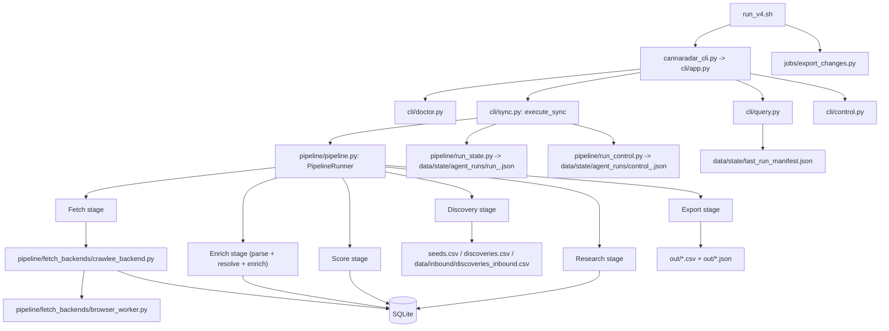

# CannaRadar Internal Docs

CannaRadar is a local-first, agent-operable lead intelligence pipeline for cannabis outbound. It ingests seed domains, crawls public sites, extracts contact and buyer signals, resolves entities into a canonical SQLite model, scores locations, generates research briefs, and exports deterministic CSVs for outreach.

This repo is not a web app or an API service. Its primary runtime is a Python 3.11 CLI in `cannaradar_cli.py`, backed by `cli/` command modules and `pipeline/` orchestration/stage code. The system is built to run as a batch pipeline, optionally under an external scheduler via `run_v4.sh`, with resumable state and bounded agent controls for live runs.

## Start Here

1. Read [01-purpose-and-overview.md](./01-purpose-and-overview.md) for the product and operating model.
2. Read [02-architecture.md](./02-architecture.md) for the system boundary map.
3. Read [04-runtime-flow.md](./04-runtime-flow.md) for startup and end-to-end execution flow.
4. Read [10-state-and-lifecycle.md](./10-state-and-lifecycle.md) for checkpoint, control, and crawl status state transitions.
5. Keep [12-how-to-modify-the-system.md](./12-how-to-modify-the-system.md) open when changing behavior.

## One-Screen Mental Model

1. `cli/app.py:main` is the canonical process entrypoint.
2. `cli/sync.py:execute_sync` is the batch run orchestrator used by `sync`, `crawl:run`, and `tail`.
3. `pipeline/pipeline.py:PipelineRunner` coordinates the actual stage work.
4. `pipeline/fetch_backends/crawlee_backend.py:run_fetch` is the most operationally complex subsystem. It does HTTP-first crawling, block detection, browser escalation, self-healing, runtime control polling, and persistence into crawl tables.
5. `pipeline/pipeline.py:PipelineRunner.run_enrich` folds three conceptual steps together: parse, resolve, and enrich.
6. SQLite in `data/cannaradar_v1.db` is the source of truth. JSON checkpoint/control files under `data/state/agent_runs/` are the source of resumability and live agent steering. CSVs under `out/` are the operator-facing outputs.

## Architecture At A Glance

## Document Index

- [01-purpose-and-overview.md](./01-purpose-and-overview.md)
- [02-architecture.md](./02-architecture.md)
- [03-repo-structure.md](./03-repo-structure.md)
- [04-runtime-flow.md](./04-runtime-flow.md)
- [05-loops-processes-and-automation-cycles.md](./05-loops-processes-and-automation-cycles.md)
- [06-data-flow.md](./06-data-flow.md)
- [07-key-components.md](./07-key-components.md)
- [08-config-and-environment.md](./08-config-and-environment.md)
- [09-external-dependencies.md](./09-external-dependencies.md)
- [10-state-and-lifecycle.md](./10-state-and-lifecycle.md)
- [11-failure-modes-and-recovery.md](./11-failure-modes-and-recovery.md)
- [12-how-to-modify-the-system.md](./12-how-to-modify-the-system.md)

## Existing Operational Docs

These pre-existing docs remain useful and are referenced by the new internal set:

- [`README.md`](../README.md)
- [`docs/AGENT_OPS_PLAYBOOK.md`](./AGENT_OPS_PLAYBOOK.md)
- [`docs/RUNBOOK_V1.md`](./RUNBOOK_V1.md)
- [`docs/schemas/cli/v1/`](./schemas/cli/v1/)

