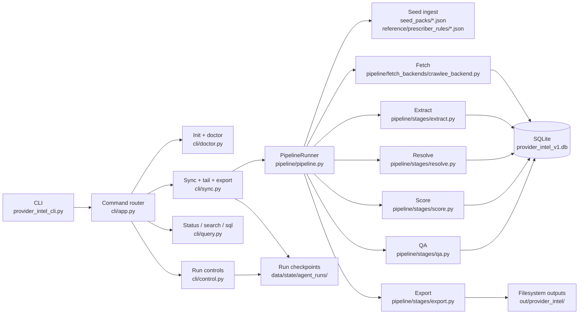
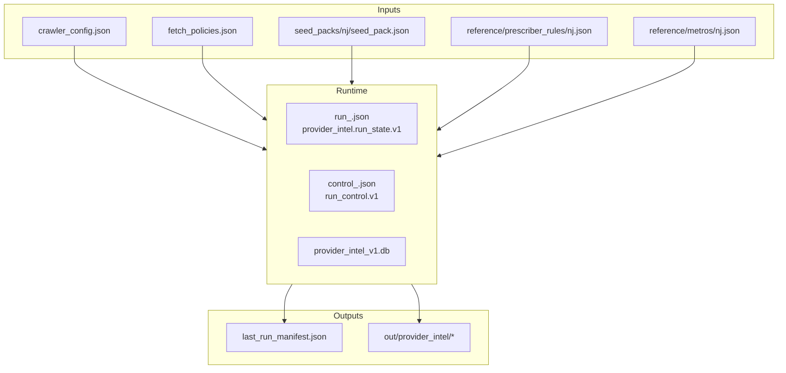

# Architecture

Last verified against commit `0c5e92b`.

## System Overview

The runtime is a local-first provider intelligence engine for New Jersey ASD/ADHD provider discovery and verification. The primary entrypoint is `provider_intel_cli.py`, which dispatches into `cli/app.py`. The main execution path then flows through:

- `cli/sync.py` for orchestration and resumability
- `pipeline/pipeline.py` for stage wiring
- `pipeline/fetch_backends/crawlee_backend.py` for HTTP and browser crawl execution
- `pipeline/stages/*.py` for extract, resolve, score, QA, and export
- `jobs/ingest_sources.py` and `db/schema.sql` for schema bootstrap and reference-rule loading

The architecture is intentionally conservative:

- SQLite is the canonical runtime store.
- Local JSON files define seeds, prescriber rules, crawl config, and domain policies.
- Critical claims are only exported if evidence exists in `field_evidence`.
- Uncertain or contradictory records are routed to `review_queue`.

## Component Responsibilities

| Component | Files | Responsibility |
| --- | --- | --- |
| CLI shell | `provider_intel_cli.py`, `cli/app.py` | Parse commands, enforce Python 3.11+, emit plain or JSON payloads |
| Bootstrap | `cli/doctor.py`, `jobs/ingest_sources.py`, `db/schema.sql` | Create config/policy files, initialize schema, validate environment and schema metadata |
| Run orchestration | `cli/sync.py`, `pipeline/pipeline.py`, `pipeline/run_state.py` | Execute stages in order, checkpoint progress, support resume |
| Runtime controls | `cli/control.py`, `pipeline/run_control.py` | Show/apply bounded domain controls and persist interventions |
| Fetch layer | `pipeline/stages/fetch.py`, `pipeline/fetch_backends/crawlee_backend.py`, `pipeline/fetch_backends/browser_worker.py`, `pipeline/fetch_backends/domain_policy.py` | Seed crawl jobs, enforce per-domain policies, escalate to browser when blocked |
| Extraction layer | `pipeline/stages/parse.py`, `pipeline/stages/extract.py` | Convert HTML into deterministic extracted records plus evidence snippets |
| Entity resolution | `pipeline/stages/resolve.py` | Build providers, practices, licenses, provider-practice records, and review-only items |
| Scoring | `pipeline/stages/score.py` | Apply NJ prescriber rules, calculate field confidence, record confidence, and outreach fit |
| QA gate | `pipeline/stages/qa.py` | Block records missing critical evidence, record contradictions, mark outreach readiness |
| Export | `pipeline/stages/export.py` | Produce CSV/JSON/profile/evidence/review/outreach artifacts |
| Observability | `pipeline/observability.py` | Structured JSON logs and in-memory counters |

## Runtime Execution Flow

The `sync` command in `cli/sync.py` executes a fixed stage order from `pipeline/run_state.py`:

1. `seed_ingest`
2. `crawl`
3. `extract`
4. `resolve`
5. `score`
6. `qa`
7. `export`

Each completed stage writes its own result payload into the run-state JSON. On failure, the current stage is marked `failed`, `last_error` is written, and the run can later resume from the next incomplete stage.

## Tooling Boundaries

What is inside the runtime:

- Python command and stage orchestration
- SQLite persistence
- Crawlee HTTP crawling
- Optional Playwright-backed browser crawling
- Markdown and fallback PDF export generation

What is outside the runtime:

- No remote queue or scheduler
- No secrets manager
- No external API dependency for scoring or QA
- No current HTML-to-PDF renderer beyond the fallback PDF writer
- No multi-state prescribing rules beyond New Jersey

## Notes On Accuracy And Current Gaps

- `--crawl-mode` is accepted by `cli/app.py` and stored in run metadata by `cli/sync.py`, but the current stage runner does not branch on it.
- `--crawlee-headless` is also stored in sync options, but the fetch layer still reads effective headless mode from config or env via `pipeline/config.py`.
- `pipeline/quality.py` is legacy code from the prior product surface and is not part of the active provider-intel execution path.
