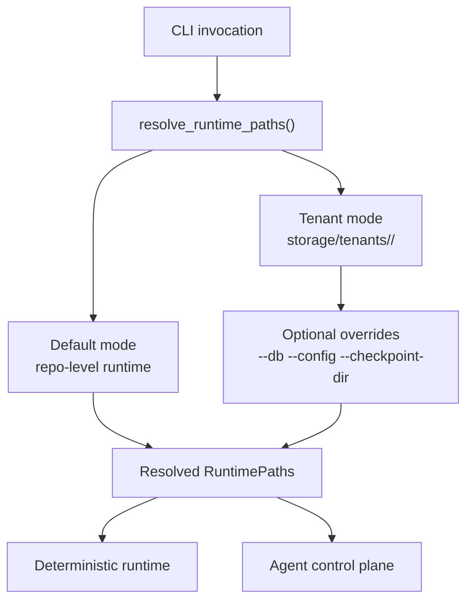
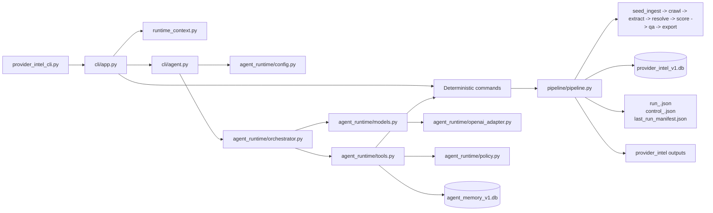
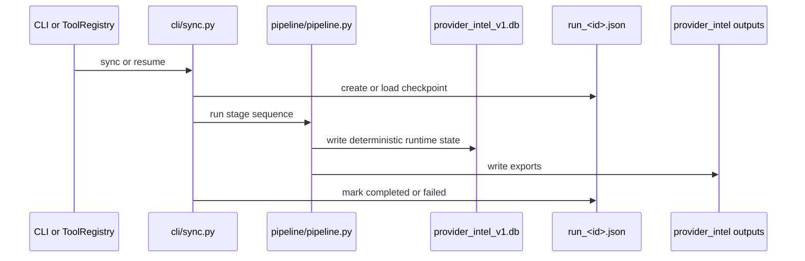
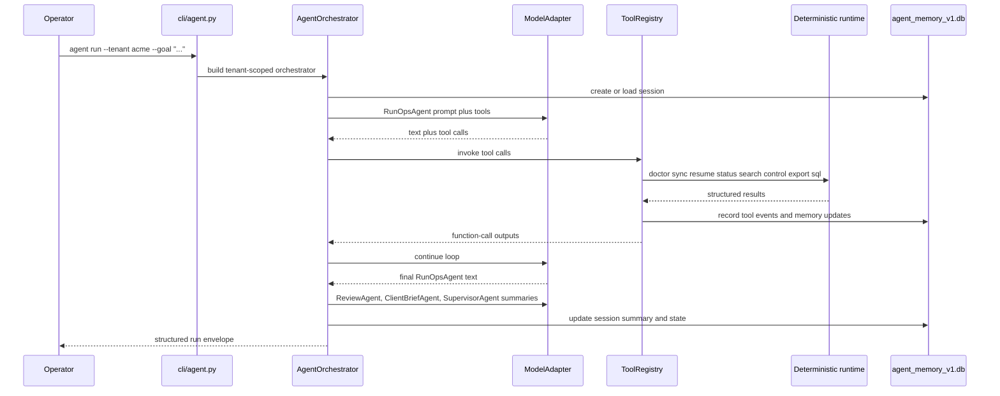

# Architecture

Last verified against commit `bd51843`.

## System Boundary

ABAProviderIntelligenceEngine is source-available public code for a local-first
provider intelligence runtime. It has two execution surfaces:

- the deterministic provider-intel runtime exposed through `init`, `doctor`,
  `sync`, `status`, `search`, `control`, `sql`, and `export`
- an optional tenant-scoped local agent control plane exposed through
  `agent run`, `agent status`, and `agent resume`

The architectural boundary is strict:

- `crawl -> extract -> resolve -> score -> qa -> export` remains the only path
  that writes provider truth
- the agent layer may orchestrate runs, inspect outputs, apply bounded runtime
  controls, and summarize results
- the agent layer must not write provider truth directly, bypass QA, or mutate
  seeds, config, or code
- there is no hosted multi-user service, in-repo auth layer, or remote control
  plane in this repository

## Execution Surfaces

| Surface | Entry points | Responsibility | Writes truth? |
| --- | --- | --- | --- |
| Deterministic runtime | `provider_intel_cli.py`, `cli/app.py`, `cli/sync.py`, `cli/query.py`, `cli/control.py`, `cli/doctor.py` | Crawl, extract, resolve, score, QA, export, and inspect the provider-intel runtime | Yes |
| Agent control plane | `cli/agent.py`, `agent_runtime/*` | Plan bounded work, call the deterministic runtime as tools, persist agent memory, and produce operator summaries | No |

## Runtime Modes And Tenant Isolation

The runtime now supports two path-resolution modes:

- default local mode with shared repository-level paths
- tenant-scoped mode with isolated runtime roots under
  `storage/tenants/<tenant_id>/`

In this codebase, a tenant means a client/account/workspace boundary such as
"your runtime" versus "John's runtime." It is not a seed pack. Seeds define
what gets crawled; tenants define where runtime state lives.

Tenant isolation is implemented in
[runtime_context.py](/Users/horcrux/Development/CannaRadar/runtime_context.py)
through `RuntimePaths` and `TenantContext`. The implementation does not add
`tenant_id` columns to `provider_intel.v1` tables. Instead, each tenant gets a
separate filesystem root and separate SQLite files.

### Path Resolution Rules

1. If `--tenant` is omitted, the CLI uses legacy repository-level defaults.
2. If `--tenant <id>` is provided, the CLI derives tenant paths under
   `storage/tenants/<tenant_id>/`.
3. If `--tenant-root-base` is provided, that base replaces
   `storage/tenants/`.
4. Explicit path flags such as `--db`, `--config`, and `--checkpoint-dir`
   override the derived defaults for that invocation.

### Runtime Path Layout

| Path type | Default mode | Tenant mode |
| --- | --- | --- |
| Config dir | repo root | `storage/tenants/<tenant>/config/` |
| Data dir | `data/` | `storage/tenants/<tenant>/data/` |
| State dir | `data/state/` | `storage/tenants/<tenant>/state/` |
| Output root | `out/` | `storage/tenants/<tenant>/out/` |
| Memory dir | `data/memory/` | `storage/tenants/<tenant>/memory/` |
| Business DB | `data/provider_intel_v1.db` | `storage/tenants/<tenant>/data/provider_intel_v1.db` |
| Crawler config | `crawler_config.json` | `storage/tenants/<tenant>/config/crawler_config.json` |
| Checkpoints | `data/state/agent_runs/` | `storage/tenants/<tenant>/state/agent_runs/` |
| Agent config | `agent_config.json` | `storage/tenants/<tenant>/config/agent_config.json` |
| Agent memory DB | `data/memory/agent_memory_v1.db` | `storage/tenants/<tenant>/memory/agent_memory_v1.db` |

`RuntimePaths` also derives these subordinate locations:

- `provider_out_dir`: `out/provider_intel/` or
  `storage/tenants/<tenant>/out/provider_intel/`
- `manifest_path`: `last_run_manifest.json`
- `lock_path`: `run_v4.lock`
- `fetch_policies_path`: `fetch_policies.json`
- `agent_config_path`: `agent_config.json`
- `agent_memory_db_path`: `agent_memory_v1.db`

## Layered Architecture

## Deterministic Runtime

The deterministic runtime is still the core of the system. It is responsible
for all business truth, approvals, contradictions, review queues, and exports.

Primary implementation files:

- [cli/sync.py](/Users/horcrux/Development/CannaRadar/cli/sync.py)
- [pipeline/pipeline.py](/Users/horcrux/Development/CannaRadar/pipeline/pipeline.py)
- [pipeline/run_state.py](/Users/horcrux/Development/CannaRadar/pipeline/run_state.py)
- [cli/query.py](/Users/horcrux/Development/CannaRadar/cli/query.py)
- [cli/control.py](/Users/horcrux/Development/CannaRadar/cli/control.py)
- [cli/doctor.py](/Users/horcrux/Development/CannaRadar/cli/doctor.py)

### Stage Order

Each run executes the same stage sequence:

1. `seed_ingest`
2. `crawl`
3. `extract`
4. `resolve`
5. `score`
6. `qa`
7. `export`

This stage order is fixed even when the operator uses refresh-oriented fetch
settings such as `--crawl-mode refresh`. Refresh mode narrows fetch breadth, but
it does not create a partial truth-writing path around the main runtime.

### Runtime Artifacts

The deterministic runtime writes:

- business truth to `provider_intel_v1.db`
- checkpoint files as `run_<id>.json`
- bounded control files as `control_<id>.json`
- a latest-run pointer at `last_run_manifest.json`
- export artifacts under `provider_out_dir`

On failure, the run state records the failed stage and `last_error`. The
operator can continue with `sync --resume <run_id>` or `sync --resume latest`.

## Agent Control Plane

The agent layer is an orchestration shell above the deterministic runtime. It
does not introduce a second truth path. It turns the existing CLI/runtime into
a tool-driven control plane with session memory and provider-neutral model
adapters.

Primary implementation files:

- [cli/agent.py](/Users/horcrux/Development/CannaRadar/cli/agent.py)
- [agent_runtime/orchestrator.py](/Users/horcrux/Development/CannaRadar/agent_runtime/orchestrator.py)
- [agent_runtime/tools.py](/Users/horcrux/Development/CannaRadar/agent_runtime/tools.py)
- [agent_runtime/policy.py](/Users/horcrux/Development/CannaRadar/agent_runtime/policy.py)
- [agent_runtime/memory.py](/Users/horcrux/Development/CannaRadar/agent_runtime/memory.py)
- [agent_runtime/config.py](/Users/horcrux/Development/CannaRadar/agent_runtime/config.py)
- [agent_runtime/openai_adapter.py](/Users/horcrux/Development/CannaRadar/agent_runtime/openai_adapter.py)

### Entry-Point Flow

`cli/agent.py` performs the assembly work:

1. Build `TenantContext` from CLI args and resolved `RuntimePaths`.
2. Load the per-tenant `agent_config.json`.
3. Construct `SessionStore` and `MemoryStore` on the tenant's
   `agent_memory_v1.db`.
4. Create a `PolicyEngine` and `ToolRegistry`.
5. Choose a model adapter.
6. Build `AgentOrchestrator`.
7. Dispatch `agent run`, `agent status`, or `agent resume`.

Important behavior:

- `agent run` and `agent resume` use `OpenAIResponsesAdapter` today and require
  `OPENAI_API_KEY`
- `agent status` is read-only and intentionally uses a non-generating adapter,
  so it works without model credentials

### Internal Agent Roles

The orchestrator keeps prompt separation between four internal roles:

| Role | Responsibility | Can request tools? |
| --- | --- | --- |
| `SupervisorAgent` | Own the operator goal and produce the final trusted synthesis | No |
| `RunOpsAgent` | Decide which bounded tools to call and when to stop | Yes |
| `ReviewAgent` | Interpret review queue, contradictions, and unresolved QA risk | No |
| `ClientBriefAgent` | Produce concise operator/client-facing summaries | No |

Only `RunOpsAgent` requests tool execution. The other roles summarize structured
results after tool execution has finished.

### Orchestration Loop

`AgentOrchestrator.run(goal, tenant_context, session_id=None)` is the supported
programmatic surface.

The loop is:

1. Create or load an agent session.
2. Append the operator goal as a `SupervisorAgent` user turn.
3. Build memory context from `client_profiles`, `domain_tactics`, and recent
   `run_memory`.
4. Ask `RunOpsAgent` for the next step and available tool calls.
5. Validate tool calls with `PolicyEngine`.
6. Execute tools through `ToolRegistry`.
7. Record every tool event with tenant id, session id, timestamps, inputs,
   outputs, status, and reason.
8. Feed tool outputs back into the model as function-call output messages.
9. Stop when the model stops requesting tools or `max_turns` is reached.
10. Run `ReviewAgent`, `ClientBriefAgent`, and `SupervisorAgent` summaries.
11. Persist session summary, unresolved risks, recommended next actions, and
    latest run id.

The returned envelope includes:

- `tenant_id`
- `session_id`
- `goal`
- `tools_used`
- `run_ids`
- `exports`
- `unresolved_risks`
- `recommended_next_actions`
- `memory_updates`
- `summaries`

## Tool Contract And Policy Enforcement

The agent tool surface is provider-neutral. Today it exposes these operations:

- `doctor`
- `sync`
- `resume`
- `status`
- `search`
- `control_show`
- `control_apply`
- `export`
- `sql`

The tool registry does not implement a second execution engine. It calls the
existing deterministic command handlers directly:

- `run_doctor`
- `execute_sync`
- `run_status`
- `run_search`
- `run_sql`
- `run_control_show`
- `run_control_apply`
- `execute_export`

### Policy Rules

`agent_runtime/policy.py` currently enforces:

- only the allowed tool names above may be called
- every call must include a non-empty `reason`
- `control_apply` only allows these bounded actions:
  `quarantine-seed`, `suppress-prefix`, `cap-domain`, `stop-domain`,
  `clear-domain`
- `cap-domain` requires a positive `max_pages`
- `suppress-prefix` requires a non-empty `prefix`
- SQL must start with `SELECT` or `WITH`

### Tool Execution Semantics

`ToolRegistry` also owns some important runtime behavior:

- it executes inside a tenant-scoped runtime environment by setting crawler
  config env vars to the resolved `config_path`
- if the tenant runtime does not exist yet, it bootstraps it with `init` before
  executing the requested tool
- it records every tool result in `agent_tool_events`
- it updates `run_memory` after successful `sync` and `resume`
- it updates `domain_tactics` after successful `control_apply`

## Storage Topology

There are now two distinct persistence layers per runtime root.

### Deterministic Business State

This layer is the source of truth and includes:

- `provider_intel_v1.db`
- `run_<id>.json`
- `control_<id>.json`
- `last_run_manifest.json`
- exported provider-intel artifacts

### Agent Control-Plane State

This layer is stored separately in `agent_memory_v1.db` and includes:

- `agent_sessions`
- `agent_turns`
- `agent_tool_events`
- `run_memory`
- `domain_tactics`
- `client_profiles`

This separation matters because:

- the agent runtime can evolve without changing the deterministic business
  schema
- session traces and heuristics do not pollute provider truth tables
- tenant isolation is achieved through separate files, not shared-row tagging

### Memory Semantics

The memory store uses different keys for different data classes:

- `run_memory` is keyed by `run_id`
- `domain_tactics` is keyed by normalized domain
- `client_profiles` is keyed by tenant-owned `client_id`

`domain_tactics` also stores:

- `last_confirmed_source_url`
- `last_confirmed_at`
- `decay_at`

That supports stale-tactic decay without altering the core provider-truth
tables.

## Configuration Boundary

The runtime now has two relevant config families:

- crawler/runtime config through `crawler_config.json` and
  `fetch_policies.json`
- agent config through `agent_config.json`

`agent_runtime/config.py` defines `AgentConfig` with:

- `provider`
- `model`
- `max_turns`
- `retry_limit`
- `retry_backoff_seconds`
- `request_timeout_seconds`
- `autonomy_mode`
- `default_client_id`
- `provider_options`

The default provider configuration targets the OpenAI Responses endpoint at
`https://api.openai.com/v1/responses`. The CLI `--model` flag overrides only
the model for that invocation; it does not rewrite tenant config.

## Model Provider Boundary

The control plane is designed around the provider-neutral
`ModelAdapter` interface in
[agent_runtime/models.py](/Users/horcrux/Development/CannaRadar/agent_runtime/models.py).

Current shipped backend:

- `OpenAIResponsesAdapter`

Current implementation traits:

- uses direct HTTP requests with the Python standard library
- requires `OPENAI_API_KEY`
- retries transient HTTP and network failures
- serializes the repo's tool definitions into the Responses API format
- converts function calls back into the internal provider-neutral tool-call
  structure

Architecturally, this means:

- OpenAI is the first adapter, not the defining runtime abstraction
- the orchestrator, policy engine, tool registry, session store, and memory
  store do not depend on OpenAI-specific types
- future model providers can slot behind `ModelAdapter` without changing the
  deterministic runtime

No OpenAI Agents SDK dependency is used in the runtime core.

## Resume, Recovery, And Failure Handling

There are two different resume scopes in the implementation:

- `sync --resume <run_id>` or the `resume` tool continues a deterministic
  pipeline run from checkpointed stage state
- `agent resume --session-id <id>` continues the agent session using the
  persisted goal, prior tool trace, and existing tenant runtime state

If a tool call fails:

- `ToolRegistry` captures the error as a structured failed tool event
- the agent session remains inspectable through `agent status`
- the deterministic checkpoint files remain available for a later `resume`
- if `AgentOrchestrator.run()` exits with an exception, the session is marked
  `failed`

## Architectural Constraints

These are non-negotiable implementation rules:

- QA remains the evidence gate for approved provider truth
- the agent may orchestrate but may not approve unsupported truth
- tenant isolation is path-based and runtime-root-based in this version
- the business DB and agent memory DB remain separate
- read-only inspection is allowed through `status`, `search`, and `sql`
- control actions must stay bounded and auditable
- the repository remains local-first even when agent commands call the OpenAI
  Responses API

## What This Repository Does Not Implement

The current architecture does not include:

- a hosted SaaS control plane
- user authentication or RBAC
- shared-schema multi-tenant storage with `tenant_id` columns
- autonomous editing of seeds, crawler config, or code from the agent loop
- any truth-writing path outside the deterministic stage pipeline

## Notes And Current Scope

- `--crawl-mode refresh` narrows fetch breadth using monitor-oriented config
  fields, but still runs the full deterministic stage sequence
- `--crawlee-headless on|off` is a per-invocation runtime override for `sync`
  and `resume`
- `pipeline/quality.py` is legacy and not part of the active provider-intel
  execution path
- the current provider scope, prescriber rules, and safety logic remain
  New Jersey specific
