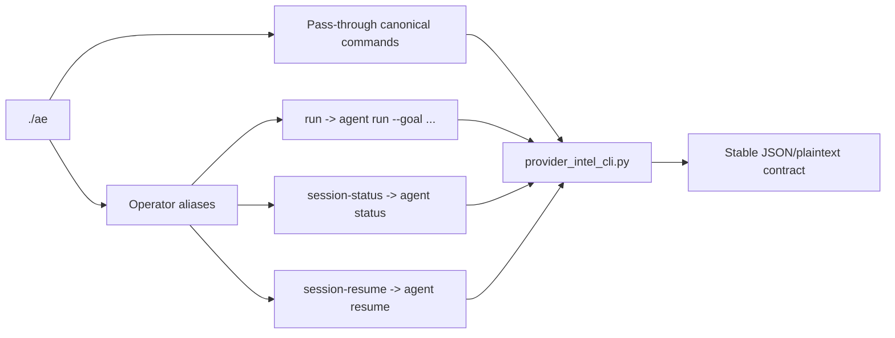

# CLI Reference

Last verified against commit `0c5e92b`.

The canonical CLI entrypoint is `provider_intel_cli.py`.

The repo also ships a thin human-facing wrapper at `./ae`. It forwards
canonical commands unchanged and adds a small set of convenience aliases for
agent sessions. The canonical machine interface remains `provider_intel_cli.py`.

## Friendly Wrapper

From the repo root:

```bash
./ae init --json
./ae sync --json --max 3 --limit 10
./ae status --json
./ae run --json --trace --tenant acme "Run a bounded provider-intel loop"
./ae session-status --json --tenant acme
./ae session-resume --json --tenant acme --session-id sess_123
```

Wrapper rules:

- Canonical commands such as `init`, `doctor`, `sync`, `status`, `search`,
  `control`, `sql`, `export`, and `agent` pass through unchanged.
- `run` maps to `agent run --goal ...`.
- `session-status` maps to `agent status`.
- `session-resume` maps to `agent resume`.
- `--trace` on `run` and `session-resume` streams visible agent activity to
  stderr without breaking JSON stdout.
- The wrapper does not replace the canonical CLI contract; it is a translation
  layer for operators.



## Global Flags

| Flag | Meaning | Notes |
| --- | --- | --- |
| `--db` | Alternate SQLite path | Defaults to `data/provider_intel_v1.db` |
| `--db-timeout-ms` | SQLite timeout in milliseconds | Applied to writable and read-only CLI DB connections, and mirrored to `PRAGMA busy_timeout` |
| `--config` | Alternate `crawler_config.json` | Also sets `PROVIDER_INTEL_CONFIG` and `PROVIDER_INTEL_CRAWLER_CONFIG` for the process |
| `--tenant` | Tenant id for an isolated runtime root | When set, default DB/config/checkpoint/output paths move under `storage/tenants/<tenant_id>/` unless explicitly overridden |
| `--tenant-root-base` | Override the base directory for tenant runtime roots | Used only when `--tenant` is set |
| `--json` | Emit strict JSON envelope | Uses schema `provider_intel.cli.v1` |
| `--plain` | Emit plain-text output | Default |

## Command Reference

### `init`

Create config, fetch-policy file, DB schema, and state directories.

```bash
python provider_intel_cli.py init --json
python provider_intel_cli.py init --json --db /tmp/provider_intel.db --config /tmp/crawler_config.json
```

Flags:

- `--checkpoint-dir`

### `doctor`

Run environment and schema diagnostics.

```bash
python provider_intel_cli.py doctor --json
python provider_intel_cli.py doctor --json --config ./crawler_config.json
```

Checks performed in `cli/doctor.py`:

- Python version
- Config path and JSON load
- Seed pack presence
- Prescriber rule pack presence
- Writable DB/output/state directories
- DB open and schema validation
- Crawlee import
- Playwright import
- Disk space

Flags:

- `--checkpoint-dir`

### `sync`

Run the full pipeline with checkpointing.

```bash
python provider_intel_cli.py sync --json --max 10 --limit 25
python provider_intel_cli.py sync --json --seeds seed_packs/examples/cassia_live_test.json --max 2 --limit 10
python provider_intel_cli.py sync --json --resume latest
```

Flags:

| Flag | Meaning | Actual behavior |
| --- | --- | --- |
| `--seeds` | Seed pack path | Active |
| `--max` | Seed limit | Active |
| `--crawl-mode` | `full` or `refresh` | `refresh` uses `monitorMaxPagesPerDomain`, `monitorMaxTotalPages`, and `monitorMaxDepth` to narrow fetch breadth while keeping the same stage order |
| `--limit` | Export limit | Active, passed to export |
| `--crawlee-headless` | `on` or `off` | Overrides the effective browser headless mode for that sync run |
| `--run-id` | Explicit run id | Active |
| `--resume` | Resume a checkpoint by id or `latest` | Active |
| `--checkpoint-dir` | Alternate checkpoint directory | Active |

### `tail`

Loop `sync` on an interval for continuous operation.

```bash
python provider_intel_cli.py tail --json --interval-seconds 600 --iterations 3 --max 5 --limit 25
```

Additional flags:

- `--interval-seconds`
- `--iterations`

### `status`

Summarize current DB counts, last manifest, checkpoint state, run control state, output snapshots, DB metadata, and recent failures.

```bash
python provider_intel_cli.py status --json
python provider_intel_cli.py status --json --run-id 20260309-202814+0000
```

Flags:

- `--run-id`
- `--checkpoint-dir`

### `search`

Search provider records by name/practice, or run built-in diagnostic presets.

```bash
python provider_intel_cli.py search --json "cassia"
python provider_intel_cli.py search --json --preset outreach-ready
python provider_intel_cli.py search --json --preset contradictions --limit 50
```

Presets from `cli/query.py`:

- `failed-domains`
- `blocked-domains`
- `low-confidence-records`
- `review-queue`
- `contradictions`
- `outreach-ready`

Flags:

- positional `query`
- `--preset`
- `--limit`

### `control`

Inspect or apply bounded runtime controls for a run.

Show current state:

```bash
python provider_intel_cli.py control --json --run-id latest show
```

Apply controls:

```bash
python provider_intel_cli.py control --json --run-id latest quarantine-seed --domain noisy.example --reason blocked_seed
python provider_intel_cli.py control --json --run-id latest suppress-prefix --domain noisy.example --prefix /blog/ --reason low_value_path
python provider_intel_cli.py control --json --run-id latest cap-domain --domain noisy.example --max-pages 2 --reason bounded_retry
python provider_intel_cli.py control --json --run-id latest stop-domain --domain noisy.example --reason verification_noise
python provider_intel_cli.py control --json --run-id latest clear-domain --domain noisy.example --reason reset
```

Supported control actions:

- `show`
- `quarantine-seed`
- `suppress-prefix`
- `cap-domain`
- `stop-domain`
- `clear-domain`

### `sql`

Execute read-only SQL against the SQLite DB.

```bash
python provider_intel_cli.py sql --json --query "SELECT provider_name_snapshot, record_confidence FROM provider_practice_records ORDER BY record_confidence DESC LIMIT 20"
```

Rules from `cli/query.py`:

- Query must start with `SELECT` or `WITH`
- Write verbs like `INSERT`, `UPDATE`, `DELETE`, `DROP`, `ALTER` are rejected
- Final result is wrapped in an outer `LIMIT`

Flags:

- positional `query`
- `--query`
- `--limit`

### `export`

Re-export currently approved records without re-running crawl/extract.

The provider export emits the provider-practice `record_id` and the canonical
`provider_id` as separate fields. `provider_id` is the stable provider identity;
it must not be substituted with `record_id`.

```bash
python provider_intel_cli.py export --json --limit 100
```

Flags:

- `--limit`

### `agent`

Run the tenant-scoped provider agent control plane. `agent` commands require `--tenant`.

Run a session:

```bash
python provider_intel_cli.py --json --tenant acme agent run --trace --goal "Find NJ providers worth outbound this week"
python provider_intel_cli.py --json --tenant acme agent run --goal "Resume the last bounded refresh loop" --session-id sess_123 --model gpt-5
```

Inspect a stored session:

```bash
python provider_intel_cli.py --json --tenant acme agent status
python provider_intel_cli.py --json --tenant acme agent status --session-id sess_123
```

Resume a stored session:

```bash
python provider_intel_cli.py --json --tenant acme agent resume --session-id sess_123
```

Agent runtime notes:

- Each tenant gets its own config, DB, checkpoints, outputs, and agent memory store.
- The deterministic pipeline remains the source of truth; the agent orchestrates tools around it.
- The first model adapter targets the OpenAI Responses API, but the internal model/tool contract is provider-neutral.
- `--trace` writes human-readable session activity to stderr so operators can watch tool calls without breaking `--json` stdout.

## JSON Envelope

All `--json` responses use the envelope in `cli/output.py`:

Successful command:

```json
{
  "schema_version": "provider_intel.cli.v1",
  "command": "status",
  "ok": true,
  "message": "status completed",
  "data": {}
}
```

Error response:

```json
{
  "schema_version": "provider_intel.cli.v1",
  "command": "sql",
  "ok": false,
  "error": {
    "code": "data_validation_error",
    "message": "SQL command must start with SELECT or WITH.",
    "details": {}
  }
}
```

## Practical Recipes

### First bounded run

```bash
python provider_intel_cli.py init --json
python provider_intel_cli.py doctor --json
python provider_intel_cli.py sync --json --seeds seed_packs/examples/cassia_live_test.json --max 2 --limit 10
python provider_intel_cli.py status --json
python provider_intel_cli.py search --json --preset review-queue
```

### Refresh-mode bounded run

```bash
python provider_intel_cli.py sync --json --crawl-mode refresh --max 10 --limit 25
```

### Resume after a failure

```bash
python provider_intel_cli.py status --json
python provider_intel_cli.py sync --json --resume latest
```

### Inspect export-ready records

```bash
python provider_intel_cli.py search --json --preset outreach-ready
python provider_intel_cli.py sql --json --query "SELECT provider_name_snapshot, practice_name_snapshot, outreach_fit_score FROM provider_practice_records WHERE outreach_ready=1 ORDER BY outreach_fit_score DESC"
```

### Investigate noisy domains

```bash
python provider_intel_cli.py search --json --preset failed-domains
python provider_intel_cli.py search --json --preset blocked-domains
python provider_intel_cli.py control --json --run-id latest show
```

## Troubleshooting By Command

| Command | Symptom | What to check |
| --- | --- | --- |
| `init` | Config rewritten unexpectedly | Existing config did not look like provider-intel config; `cli/doctor.py` rewrites outdated configs |
| `doctor` | `db_schema` fails | Re-run `init`; check `db/schema.sql` checksum metadata |
| `sync` | `0` exported records | Inspect `review-queue`, `contradictions`, and critical evidence availability |
| `sync` | Browser-heavy domains still fail | Check `fetch_policies.json`, Playwright install, and blocked-domain preset |
| `status` | Missing output snapshot | Export may have produced no approved records yet |
| `search` | Empty preset results | The DB may genuinely contain no rows for that condition |
| `sql` | Rejected query | Ensure it starts with `SELECT` or `WITH` and contains no write verb |
| `export` | Empty sales report | No approved records currently have `outreach_ready=1` |

## Exit Codes

Exit codes come from `cli/errors.py`:

- `0` success
- `2` usage error
- `10` config error
- `11` auth error
- `12` network error
- `13` data validation error
- `14` storage error
- `15` resume state error
- `16` runtime error
- `17` command failed
