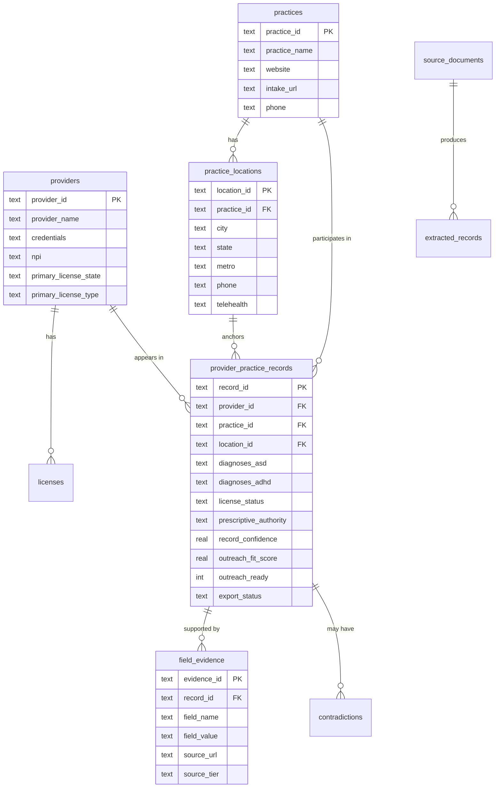
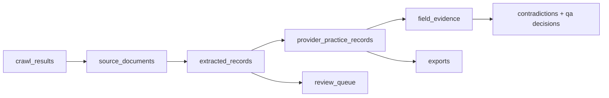

# Data Model

Last verified against commit `0c5e92b`.

## Canonical Schema Set

The active runtime uses several versioned schemas and contracts:

- `provider_intel.v1`
  The SQLite business schema in `db/schema.sql`
- `provider_intel.run_state.v1`
  The checkpoint file schema in `pipeline/run_state.py`
- `provider_intel.cli.v1`
  The JSON CLI envelope in `cli/output.py`
- `agent_memory_v1`
  The per-tenant agent session and memory schema in `agent_runtime/memory.py`
- `seed_pack.v1`
  The source manifest contract used by `pipeline/stages/discovery.py`
- `prescriber_rules.v1`
  The NJ prescriber rule pack loaded by `jobs/ingest_sources.py`
- `run_control.v1`
  The runtime control file schema in `pipeline/run_control.py`

## Core Runtime Tables

| Table | Purpose | Populated By |
| --- | --- | --- |
| `providers` | Canonical clinician identity | `pipeline/stages/resolve.py` |
| `practices` | Canonical practice identity and top-level contact URL/phone | `pipeline/stages/resolve.py` |
| `practice_locations` | Address/metro/phone/telehealth location rows | `pipeline/stages/resolve.py` |
| `licenses` | License identity, status, and official source URL | `pipeline/stages/resolve.py` |
| `provider_practice_records` | Export unit: one provider-practice-location-state affiliation | `pipeline/stages/resolve.py`, `score.py`, `qa.py` |
| `source_documents` | Raw fetched HTML and source metadata | `pipeline/pipeline.py` during extract |
| `extracted_records` | Deterministic extraction output before entity resolution | `pipeline/pipeline.py` + `pipeline/stages/extract.py` |
| `field_evidence` | Evidence per field, quote, source URL, and tier | `resolve.py`, `score.py` |
| `contradictions` | Source conflicts captured during QA | `pipeline/stages/qa.py` |
| `review_queue` | Records or practice-only signals that require human review | `resolve.py`, `qa.py` |
| `prescriber_rules` | NJ prescribing rule reference data | `jobs/ingest_sources.py` |
| `crawl_jobs` | One crawl job per seed domain per run | `pipeline/fetch_backends/common.py` |
| `crawl_results` | One fetched page payload per URL/content hash | `pipeline/fetch_backends/common.py` |
| `seed_telemetry` | Per-domain crawl health and last-run summary | `pipeline/fetch_backends/common.py` |
| `schema_migrations` | Single-version schema checksum metadata | `jobs/ingest_sources.py` |

## Relationship Summary

The exported record is `provider_practice_records`. Everything else either feeds it, verifies it, or documents why it was blocked.

## Source Lineage And Auditability

The audit chain is explicit:

1. `crawl_results` stores the fetched page payload.
2. `source_documents` records the canonical source metadata and HTML.
3. `extracted_records` stores stage output before dedupe/merge.
4. `field_evidence` preserves per-field snippets and source URLs.
5. `provider_practice_records` stores the final scored record.

## Dedupe And Identity Rules

The dedupe order is implemented in `pipeline/stages/resolve.py`:

1. NPI exact match
2. `provider_name + practice domain + state`
3. `provider_name + city + phone`
4. `provider_name + state`
5. Otherwise generate a synthetic `provider_id`

Practice identity is domain-based:

- `practice_id` is derived from `practice_name + normalized_domain(source_url)`
- `location_id` is derived from `practice_id + city + state + phone/domain`
- `record_id` is derived from `provider_id + practice_id + location_id + state`

## Run-State And Control Files

These are not stored in SQLite:

- `data/state/agent_runs/run_<id>.json` by default
  Stage checkpoint and summary state
- `data/state/agent_runs/control_<id>.json` by default
  Domain controls, runtime counters, and interventions
- `data/state/last_run_manifest.json` by default
  Last export summary written by `pipeline/pipeline.py`

When `--tenant` is used, these move under `storage/tenants/<tenant_id>/state/`.

## Agent Memory Store

The agent control plane keeps its own per-tenant SQLite file separate from the deterministic runtime DB:

- `storage/tenants/<tenant_id>/memory/agent_memory_v1.db`

Key tables in `agent_runtime/memory.py`:

- `agent_sessions`
  Stored session goal, status, last run id, and synthesized summaries
- `agent_turns`
  User and agent turns across `SupervisorAgent`, `RunOpsAgent`, `ReviewAgent`, and `ClientBriefAgent`
- `agent_tool_events`
  Tool traces with tenant id, session id, timestamps, reason, inputs, outputs, and status
- `run_memory`
  Run summaries and export reports keyed by `run_id`
- `domain_tactics`
  Per-domain tactics with decay windows and last-confirmed metadata
- `client_profiles`
  Tenant-owned client/account preferences used by the agent layer

## Migration And Versioning Notes

- Schema bootstrap is handled by `jobs/ingest_sources.init_db`.
- `PRAGMA user_version = 1` is enforced by `jobs/ingest_sources.assert_schema_migration`.
- `schema_migrations` stores a checksum of `db/schema.sql`.
- The runtime supports additive repair for outreach columns if an older `provider_practice_records` table exists.
- There is no historical migration chain for the prior product. This repo intentionally hard-pivots to a fresh provider-intel schema instead of migrating prior business data.

## Important Data-Model Caveats

- `review_queue.record_id` is not a foreign key because some review items are practice-only or unmatched-license signals.
- `source_documents.content` stores raw HTML, which is useful for audit but increases local data sensitivity.
- `provider_practice_records.source_urls_json` is an accumulated list, not a ranked source-selection table.
