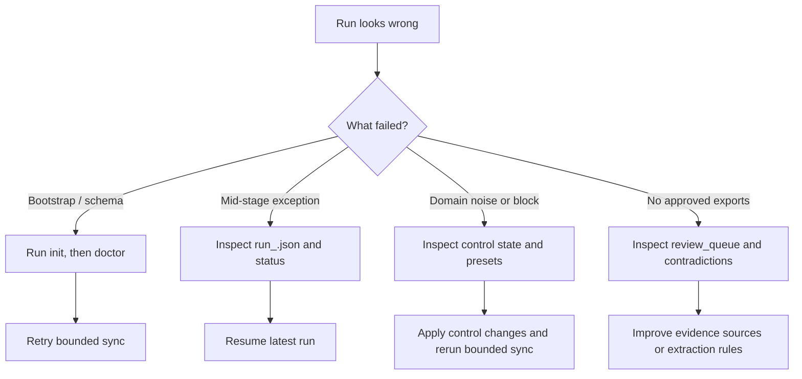

# Operations

Last verified against commit `0c5e92b`.

## Day-1 Setup

### Prerequisites

- Python `3.11`
- `pip`
- Playwright Chromium
- Writable runtime directories under `data/` and `out/` by default, or `storage/tenants/<tenant_id>/` when `--tenant` is used

### Bootstrap

```bash
python3.11 -m venv .venv
source .venv/bin/activate
python3.11 -m pip install -r requirements.txt
python3.11 -m playwright install chromium
python3.11 provider_intel_cli.py init --json
python3.11 provider_intel_cli.py doctor --json
```

Tenant-scoped bootstrap:

```bash
python3.11 provider_intel_cli.py --json --tenant acme init
python3.11 provider_intel_cli.py --json --tenant acme doctor
```

Success criteria:

- `doctor.data.summary.failed == 0`
- Default runtime: `data/provider_intel_v1.db`, `data/state/agent_runs/`, `crawler_config.json`, and `fetch_policies.json` exist
- Tenant runtime: `storage/tenants/<tenant_id>/data/provider_intel_v1.db`, `storage/tenants/<tenant_id>/state/agent_runs/`, and `storage/tenants/<tenant_id>/config/` exist

## Day-2 Operation

### Recommended operator loop

1. Start with a bounded run.
2. Check `status --json`.
3. Review `review-queue` and `contradictions`.
4. Inspect approved exports and evidence bundles.
5. Only then widen seeds or page limits.

### Bounded run

```bash
python3.11 provider_intel_cli.py sync --json --max 10 --limit 25
```

Tenant-scoped bounded run:

```bash
python3.11 provider_intel_cli.py --json --tenant acme sync --max 10 --limit 25
```

### Refresh-mode bounded run

Use this when you want the full stage sequence with smaller crawl budgets from
the `monitor*` settings in `crawler_config.json`.

```bash
python3.11 provider_intel_cli.py sync --json --crawl-mode refresh --max 10 --limit 25
```

### Bounded live test

```bash
python3.11 provider_intel_cli.py sync --json --seeds seed_packs/examples/cassia_live_test.json --max 2 --limit 10
```

### Re-export without crawling

```bash
python3.11 provider_intel_cli.py export --json --limit 100
```

### Tenant-scoped agent loop

Use this when you want the local agent control plane to orchestrate the deterministic runtime inside one isolated client or operator workspace.

```bash
python3.11 provider_intel_cli.py --json --tenant acme agent run --goal "Find NJ providers worth outbound this week"
python3.11 provider_intel_cli.py --json --tenant acme agent status
```

Requirements:

- `OPENAI_API_KEY` must be set for `agent run` or `agent resume`
- `agent status` works without model credentials because it only reads stored state

## Monitoring And Health Checks

The runtime has no separate monitoring service. Operators use:

- `provider_intel_cli.py status --json`
- `provider_intel_cli.py search --json --preset failed-domains`
- `provider_intel_cli.py search --json --preset blocked-domains`
- `provider_intel_cli.py search --json --preset review-queue`
- `provider_intel_cli.py search --json --preset contradictions`
- JSON stdout logs from `pipeline/observability.py`

Useful health questions:

- Did the run fetch pages at all?
- Did extraction produce rows?
- Did QA block all records?
- Are certain domains repeatedly blocked or quarantined?
- Did output artifacts update on disk?
- If using `agent`, did the session store useful tool traces, summaries, and next actions?

## Operating Commands

### Check current state

```bash
python3.11 provider_intel_cli.py status --json
```

Tenant-scoped:

```bash
python3.11 provider_intel_cli.py --json --tenant acme status
```

### Show run controls

```bash
python3.11 provider_intel_cli.py control --json --run-id latest show
```

### Suppress noisy path prefixes

```bash
python3.11 provider_intel_cli.py control --json --run-id latest suppress-prefix --domain npino.com --prefix /faq/ --reason noisy_navigation
```

### Cap or stop a domain

```bash
python3.11 provider_intel_cli.py control --json --run-id latest cap-domain --domain psychologytoday.com --max-pages 2 --reason bounded_sampling
python3.11 provider_intel_cli.py control --json --run-id latest stop-domain --domain psychologytoday.com --reason low_signal
```

## Incident Response



## Failure Modes And Recovery

### Stage failure

Symptoms:

- `status` shows a failed stage
- `run_<id>.json` has `last_error`

Recovery:

```bash
python3.11 provider_intel_cli.py sync --json --resume latest
```

Tenant-scoped:

```bash
python3.11 provider_intel_cli.py --json --tenant acme sync --resume latest
python3.11 provider_intel_cli.py --json --tenant acme agent resume --session-id <session_id>
```

### Schema drift or DB corruption symptoms

Symptoms:

- `doctor` fails `db_schema`
- SQLite open errors

Recovery:

```bash
python3.11 provider_intel_cli.py init --json
python3.11 provider_intel_cli.py doctor --json
```

If the DB itself is unusable, move it aside and reinitialize:

```bash
mv data/provider_intel_v1.db data/provider_intel_v1.db.bad
python3.11 provider_intel_cli.py init --json
```

Tenant-scoped equivalent:

```bash
mv storage/tenants/acme/data/provider_intel_v1.db storage/tenants/acme/data/provider_intel_v1.db.bad
python3.11 provider_intel_cli.py --json --tenant acme init
```

This is a rebuild, not an in-place rollback.

### Noisy domain behavior

Symptoms:

- Many `404`, `403`, or junk extracted pages
- Review queue fills with low-signal or false-positive items

Recovery:

1. Inspect `failed-domains`, `blocked-domains`, and `control show`.
2. Suppress prefixes or cap the domain.
3. Re-run bounded sync.

### No approved exports

Symptoms:

- Crawl and extract counts are non-zero
- `record_count` stays `0`

Recovery path:

1. Inspect `review-queue`.
2. Inspect `contradictions`.
3. Query missing critical evidence:

```bash
python3.11 provider_intel_cli.py sql --json --query "SELECT provider_name_snapshot, blocked_reason, record_confidence FROM provider_practice_records ORDER BY updated_at DESC LIMIT 25"
```

## Logging

Structured logs are emitted to stdout in JSON from `pipeline/observability.py`. Each log line includes:

- timestamp
- log level
- logger name
- `job_id`
- `stage`
- message

Counters remain in-memory per run and are attached to stage-complete events.

## Rollback Reality

There is no transactional “rollback to previous release” mechanism inside the runtime. Operational rollback today means:

- stop the current run
- keep the last good export artifacts
- restore or replace the SQLite DB if needed
- rerun bounded sync after changing config, controls, or extraction logic

## Operator Checklist

- `doctor` is clean
- seed pack is bounded appropriately
- outputs directory is writable
- checkpoint directory exists
- latest run completed or is resumable
- review queue is understood before outbound use
