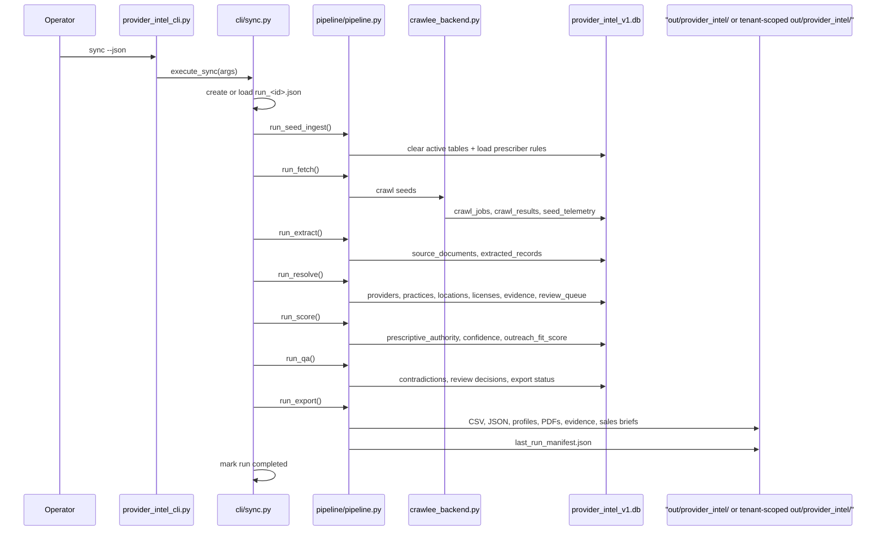
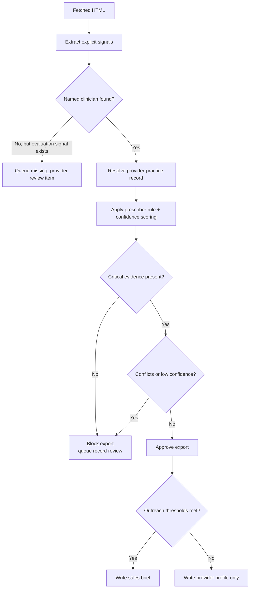
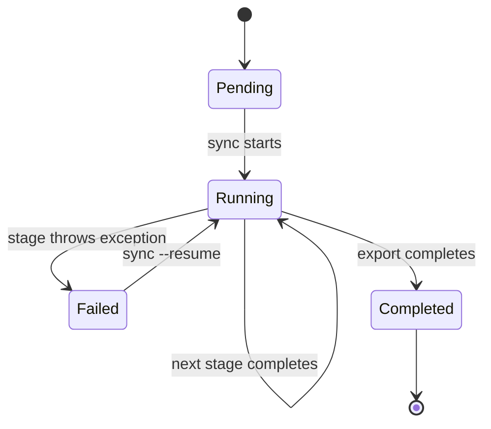

# Runtime And Pipeline

Last verified against commit `0c5e92b`.

## Pipeline Summary

The pipeline is orchestrated by `cli/sync.py` and `pipeline/pipeline.py`. A sync run persists checkpoint state before and after every stage. The stage order is fixed in `pipeline/run_state.py`:

1. `seed_ingest`
2. `crawl`
3. `extract`
4. `resolve`
5. `score`
6. `qa`
7. `export`

`sync --crawl-mode refresh` uses the monitor fetch budgets from
`crawler_config.json` for the crawl stage:

- `monitorMaxPagesPerDomain`
- `monitorMaxTotalPages`
- `monitorMaxDepth`

It does not change the stage order, and on a fresh run it still rebuilds the
active provider-intel tables during `seed_ingest`.

## Full Run Sequence

## Stage-By-Stage Detail

### 1. `seed_ingest`

Code path:

- `PipelineRunner.run_seed_ingest`
- `jobs/ingest_sources.load_reference_rules`
- `pipeline/stages/discovery.py`

Inputs:

- Seed pack JSON, usually `seed_packs/nj/seed_pack.json`
- Prescriber rules JSON, `reference/prescriber_rules/nj.json`

Behavior:

- Deletes active provider-intel tables before a fresh run
- Loads NJ prescriber rules into `prescriber_rules`
- Loads and dedupes seeds from the seed pack

Outputs:

- Seed metadata in checkpoint state
- A fresh rules table

Failure points:

- Missing seed pack
- Invalid JSON config or rule pack

### 2. `crawl`

Code path:

- `pipeline/stages/fetch.py`
- `pipeline/fetch_backends/crawlee_backend.py`
- `pipeline/fetch_backends/browser_worker.py`
- `pipeline/fetch_backends/domain_policy.py`

Inputs:

- Discovery seeds
- `crawler_config.json`
- `fetch_policies.json`

Behavior:

- Seeds each domain with the base URL plus configured `extraPaths`
- Crawls same-domain pages only
- Filters static, low-value, or suppressed paths
- Skips recently fetched pages when within `cacheTtlHours`
- Escalates to browser when policy allows and block signals are detected
- Records crawl telemetry and raw HTML

Outputs:

- `crawl_jobs`
- `crawl_results`
- `seed_telemetry`
- Runtime control updates in `control_<id>.json`

Run-control persistence contract:

- Live updates are serialized with a per-run file lock.
- Runtime writers only update `runtime.*` plus top-level run status transitions.
- Operator and agent interventions update `agent_controls.*` and append intervention entries without replacing unrelated fields.
- Direct whole-file stale-save patterns are not part of the supported live-mutation contract.

Automatic fetch interventions from `crawlee_backend.py`:

- Auto-suppress a path prefix after `3` repeated failures on that prefix
- Auto-quarantine a seed after `1` DNS failure
- Auto-stop a domain after `3` blocked failures
- Auto-disable discovery, and sometimes stop, after `8` 404 failures

### 3. `extract`

Code path:

- `pipeline/stages/extract.py`
- `pipeline/stages/parse.py`

Inputs:

- Successful `crawl_results`
- Seed metadata
- NJ metro lookup in `reference/metros/nj.json`

Behavior:

- Stores each fetched page in `source_documents`
- Produces deterministic `extracted_records`
- Captures evidence items for diagnosis, license status, NPI, and provider names when possible
- Skips blocked pages and irrelevant pages

Outputs:

- `source_documents`
- `extracted_records`

Important extraction rules:

- Explicit ASD/ADHD diagnostic language is required for `yes`
- Ambiguous mentions stay `unclear`
- Practice-only evaluation pages can become review items later if no clinician is verified

### 4. `resolve`

Code path:

- `pipeline/stages/resolve.py`

Behavior:

- Dedupes clinicians using NPI, domain/state, city/phone, then name/state
- Creates `providers`, `practices`, `practice_locations`, `licenses`, `provider_practice_records`
- Stores `field_evidence`
- Routes practice-only evaluation pages to `review_queue`
- Uses official board pages to enrich existing provider records rather than creating fake practice rows

Outputs:

- Canonical provider/practice rows
- License rows
- Review-queue items

### 5. `score`

Code path:

- `pipeline/stages/score.py`

Behavior:

- Maps credentials to NJ prescriber rules
- Adds `prescriptive_authority` evidence from the rule citation
- Computes field confidence from evidence tier
- Computes `record_confidence`
- Computes separate `outreach_fit_score` and `outreach_reasons_json`

Important distinction:

- `record_confidence` measures truth quality
- `outreach_fit_score` ranks sales usefulness after truth work is done

### 6. `qa`

Code path:

- `pipeline/stages/qa.py`

Behavior:

- Requires evidence for all critical fields:
  `diagnoses_asd`, `diagnoses_adhd`, `license_status`, `prescriptive_authority`
- Writes `contradictions` when sources disagree
- Penalizes record confidence when conflicts exist
- Queues records if confidence is low, evidence is missing, or prescribing remains `limited`/`unknown`
- Marks approved records `outreach_ready=1` only if they also meet outreach thresholds

### 7. `export`

Code path:

- `pipeline/stages/export.py`

Behavior:

- Exports only `export_status='approved'` records
- Writes provider CSV and JSON outputs with both `record_id` and canonical `provider_id`
- Writes `review_queue_<run_id>.csv`
- Writes `lead_intelligence_<run_id>.csv/.json` and dossier files only for approved/exportable records
- Keeps review-only account aggregation, when present, in distinct `internal_review_accounts_<run_id>.csv/.json` outputs
- Writes evidence bundles and Markdown profiles
- Writes fallback PDFs from Markdown
- Writes sales briefs and `sales_report_<run_id>.csv` only for `outreach_ready` records

## Decision Gates

## Checkpoints, Retries, And Resume

Checkpoint behavior from `cli/sync.py` and `pipeline/run_state.py`:

- A run is written to `data/state/agent_runs/run_<id>.json` by default, or `storage/tenants/<tenant_id>/state/agent_runs/run_<id>.json` when `--tenant` is used
- Each stage is marked `pending`, `running`, `completed`, or `failed`
- `recovery_pointer` always points to the next incomplete stage
- `sync --resume <run_id>` or `sync --resume latest` reloads that state and continues

Fetch retry behavior:

- Per-request retry count comes from `crawler_config.json` via `maxRetries`
- Browser and HTTP crawlers both use the Crawlee retry settings
- Retry counters are tracked by `Metrics`

## Runtime Artifacts

| Artifact | Location | Purpose |
| --- | --- | --- |
| Run checkpoint | `data/state/agent_runs/run_<id>.json` by default, or `storage/tenants/<tenant_id>/state/agent_runs/run_<id>.json` | Stage state, summary, recovery pointer |
| Run control | `data/state/agent_runs/control_<id>.json` by default, or `storage/tenants/<tenant_id>/state/agent_runs/control_<id>.json` | Domain controls, runtime counters, interventions |
| Last manifest | `data/state/last_run_manifest.json` by default, or `storage/tenants/<tenant_id>/state/last_run_manifest.json` | Latest export summary |
| Structured logs | stdout from `pipeline/observability.py` | JSON stage logs |

## Known Behavioral Nuances

- `sync --crawl-mode refresh` narrows fetch breadth only; it is not an incremental DB-preservation mode.
- `sync --crawlee-headless on|off` overrides the effective browser headless mode for that sync run.
- The tenant-scoped agent control plane now orchestrates the same deterministic runtime; it does not add a separate truth-writing stage.
- Export PDFs are currently fallback PDFs from Markdown, not Playwright-rendered layouts.
