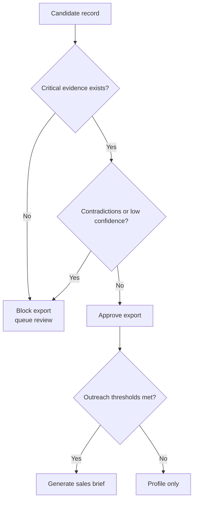

# Security And Safety

Last verified against commit `0c5e92b`.

## Security Model

This runtime is local-first. It does not expose a network service, user accounts, or a secrets manager. Trust is anchored to the machine and workspace running the CLI.

What the code actually does:

- Reads local config and seed files
- Performs outbound web requests to provider/source domains
- Can optionally call the OpenAI Responses API for the tenant-scoped agent control plane
- Stores raw fetched HTML in SQLite
- Exports local files under `out/provider_intel/` by default, or tenant-scoped output roots under `storage/tenants/<tenant_id>/out/provider_intel/`
- Stores agent session and memory data in a separate per-tenant SQLite file when `agent` commands are used

What it does not do:

- No built-in authentication layer
- No role-based access control
- No remote API for writing or reading records
- No encrypted-at-rest database feature in the repo

## Secrets And Auth Inputs

Supported config/env entrypoints:

- `PROVIDER_INTEL_CONFIG`
- `PROVIDER_INTEL_CRAWLER_CONFIG`
- `PROVIDER_INTEL_DENYLIST`
- `PROVIDER_INTEL_SEED_FILE`
- `PROVIDER_INTEL_CRAWLEE_HEADLESS`
- `PROVIDER_INTEL_CRAWLEE_PROXY_URLS`
- `PROVIDER_INTEL_CRAWLEE_DOMAIN_POLICIES_FILE`
- `OPENAI_API_KEY`

Notes:

- These are convenience config inputs, not a secret management system.
- Legacy `CANNARADAR_*` aliases remain accepted for compatibility, but new automation should prefer the `PROVIDER_INTEL_*` names.
- Proxy URLs may contain credentials depending on how the operator configures them, so treat config and shell history accordingly.
- The current code does not redact config values before logging them elsewhere.

## Safety Gates

The runtime’s primary safety mechanism is evidentiary blocking, not operator approval screens.

Critical field list from `pipeline/stages/qa.py`:

- `diagnoses_asd`
- `diagnoses_adhd`
- `license_status`
- `prescriptive_authority`

Blocking rules:

- If a critical field has no evidence row with both `source_url` and `quote`, export is blocked.
- If conflicts exist across critical fields, contradictions are written and confidence is reduced.
- If `record_confidence < 0.60`, the record is queued for review.
- If prescribing remains `limited` or `unknown`, the record is queued for review.

## Data Handling Rules

Persisted locally:

- Raw HTML in `source_documents.content`
- Evidence quotes and URLs in `field_evidence`
- Exported provider and sales artifacts in `out/provider_intel/` by default, or tenant-scoped output roots under `storage/tenants/<tenant_id>/out/provider_intel/`
- Run checkpoints in `data/state/agent_runs/` by default, or tenant-scoped state roots under `storage/tenants/<tenant_id>/state/agent_runs/`
- Per-tenant agent sessions, tool traces, run memory, domain tactics, and client profiles in `agent_memory_v1.db`

Operational implications:

- Source pages may contain phone numbers, addresses, clinician names, and other business contact information.
- Exports and DB snapshots should be treated as business-sensitive working data.
- Evidence bundles can reveal exactly which pages were crawled and quoted.

## Safe Defaults

Implemented defaults from `pipeline/config.py` and fetch code:

- `respectRobots = true`
- `maxConcurrency = 1`
- same-domain crawl only
- per-domain page caps
- cache reuse via `cacheTtlHours`
- browser escalation only when policy allows it
- low-value/static paths filtered by default
- read-only SQL enforced in `cli/query.py`

## Risk Boundaries

The system is designed for provider intelligence, not clinical advice.

Explicit boundaries reflected in code and docs:

- It does not diagnose patients.
- It does not recommend treatment.
- It does not infer unsupported clinical claims as export-ready truth.
- Prescribing logic is New Jersey-only and driven by `reference/prescriber_rules/nj.json`.
- Directory pages can still generate noisy candidates; the review queue is part of the safety design, not a bug.

## Practical Security Guidance

- Keep the repository and output directory on a trusted machine.
- Do not commit generated DB files or local exports unless intentionally versioning samples.
- Treat proxy credentials and custom config files as sensitive.
- Share provider exports, not the full raw DB, unless the recipient needs audit detail.

## Known Gaps

- No built-in redaction or encryption.
- No separate secret store.
- No permission separation between “operator” and “developer.”
- Raw HTML retention may exceed what some teams want for long-term storage; that policy has to be enforced operationally.
- The OpenAI adapter uses the process environment for API credentials; there is no first-party credential vault in the repo.
